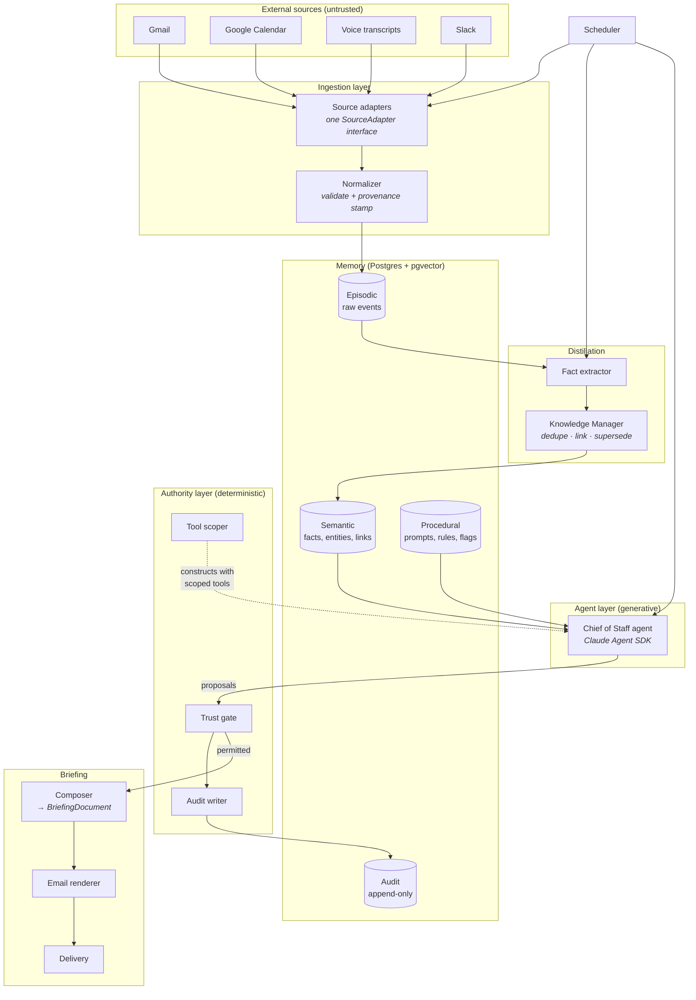
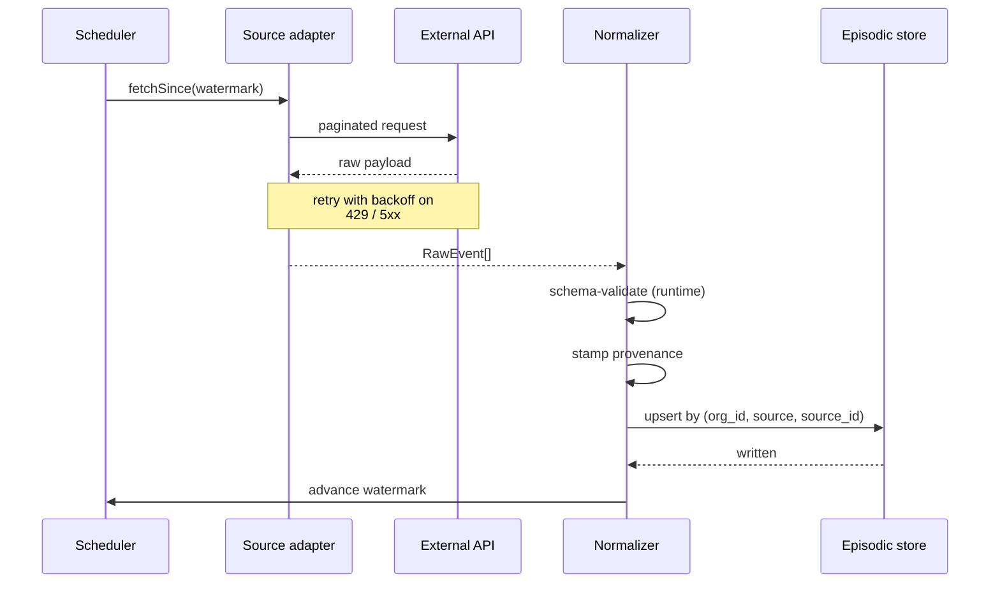
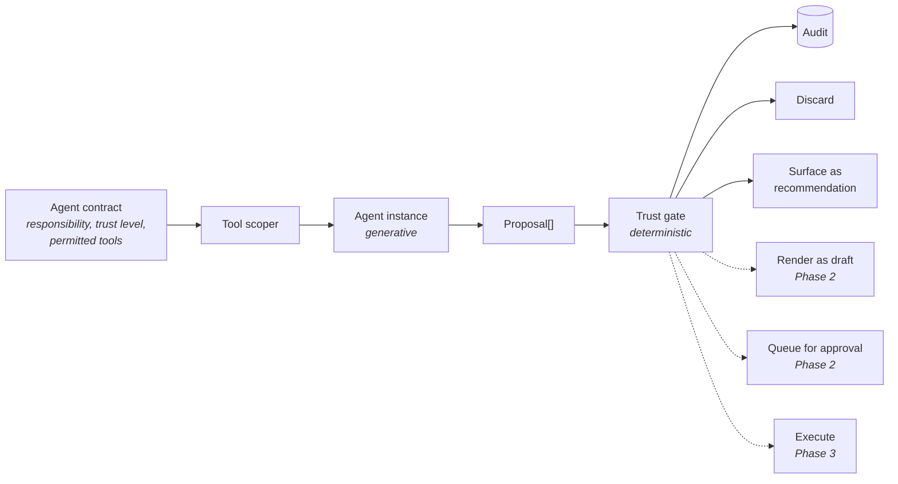
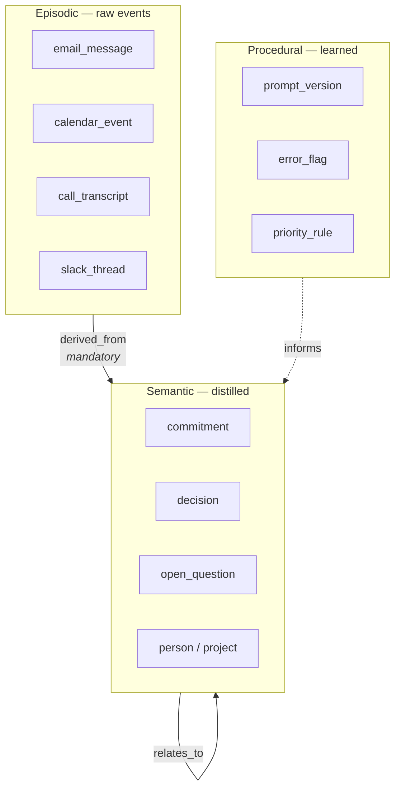
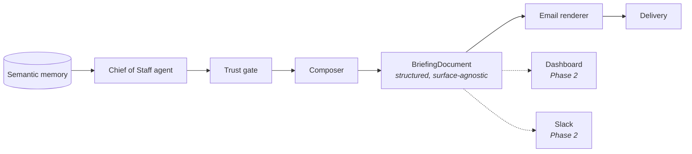
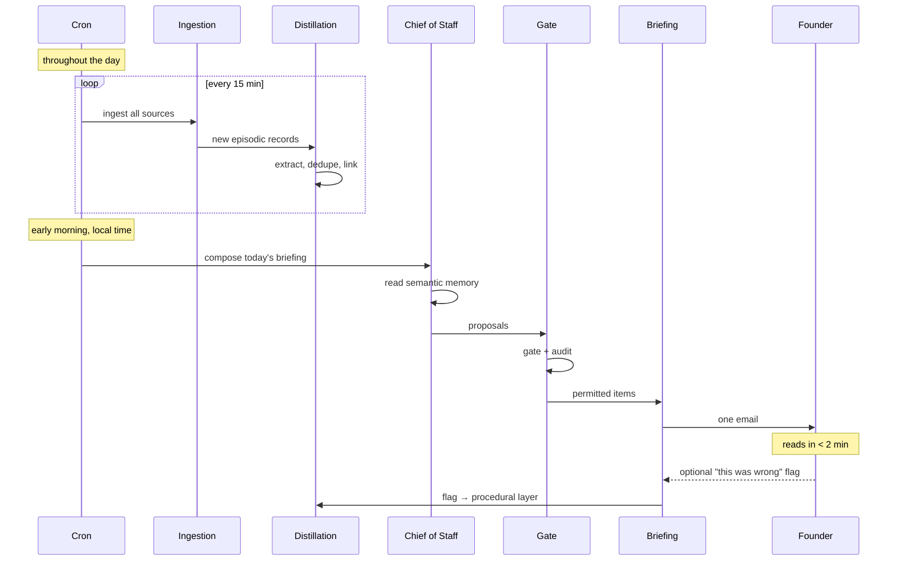

# Phase 1 — Architecture

**Date:** 2026-08-03
**Status:** Draft for critical review, per `MASTER_CONSTITUTION.md` §6

Companion to `PRD.md`. Decisions referenced here are recorded in `../decisions/`.

---

## 1. The organizing idea

One sentence governs this architecture, and every module boundary below follows from it:

> **The model decides what to propose. Deterministic code decides what is permitted.**

This is the resolution of the apparent conflict between `PRODUCT_PHILOSOPHY.md` §7 (deterministic behavior over hidden magic) and using a generative model at all, established in `ADR-0003`. Everything the constitution treats as a guarantee — trust levels, tool scoping, approval gates, audit completeness, conflict surfacing — lives in plain TypeScript that the agent runs *inside of* and cannot reach around. The model's output is a **proposal**, never an effect.

The practical consequence, and the thing to hold onto when reading the module list: there is exactly one code path from proposal to effect, it is deterministic, and it is the same path that writes the audit record. An action cannot happen without being logged, because logging and authorizing are the same function.

## 2. System shape



Note what the diagram does *not* contain: an arrow from the agent to anything except the gate. That absence is the architecture.

## 3. Module inventory

Every module below has a single responsibility, a documented interface, and no knowledge of its callers, per `ENGINEERING_STANDARDS.md`. Interfaces are specified in `API_CONTRACTS.md`.

| Module | Responsibility | Depends on |
|---|---|---|
| `sources/*` | One adapter per external system; fetch raw events since a watermark | Nothing internal |
| `ingest/normalizer` | Validate adapter output at the trust boundary, stamp provenance, write episodic records idempotently | `memory/repositories` |
| `memory/repositories` | All data access. No SQL anywhere else. | Postgres |
| `distill/extractor` | Turn episodic records into candidate semantic facts | Agent layer, `memory/repositories` |
| `distill/knowledge-manager` | Deduplicate, link, and supersede semantic records | `memory/repositories` |
| `agents/*` | Agent contracts and prompts. Produce proposals; hold no authority. | `runtime/substrate` |
| `runtime/substrate` | The only module that talks to the Claude Agent SDK | Claude Agent SDK |
| `authority/tool-scoper` | Build an agent's permitted tool set from its contract, at construction | `agents/*` contracts |
| `authority/trust-gate` | Decide proposal disposition from trust level and impact class | `authority/audit` |
| `authority/audit` | Write append-only audit records | `memory/repositories` |
| `briefing/composer` | Assemble permitted proposals into a `BriefingDocument` | `memory/repositories` |
| `briefing/renderers/email` | Render a `BriefingDocument` to HTML and plain text | Nothing but the document type |
| `briefing/delivery` | Send via the transactional email provider | Provider SDK |
| `scheduler` | Trigger ingestion, distillation, and briefing generation on schedule | All pipelines |
| `observability` | Structured logging, metrics, tracing | — |

Dependencies flow downward only. A circular dependency between modules is a build failure, not a lint warning (`ENGINEERING_STANDARDS.md`).

## 4. The ingestion boundary

All four sources implement one interface. This is what makes `ADR-0006`'s sequential increments a delivery decision rather than an architectural one — adding increment 1b or 1c means writing an adapter, not touching the pipeline.



Four properties are load-bearing:

**The boundary is a trust boundary.** Adapter output is validated against a runtime schema, not merely typed. TypeScript types vanish at runtime and every external payload is untrusted (`SECURITY_STANDARDS.md`). A malformed payload fails validation and is quarantined, not written.

**Content is data, never instruction.** Ingested text — email bodies, transcripts, Slack messages — is stored and later passed to agents as clearly delimited data. Prompt injection is not defended against by asking the model to be careful; it is defended against by the agent having no tools capable of harm (§5) and by the gate refusing anything above its trust level. An injected instruction that successfully convinces the model to propose a deletion produces a gate refusal and an alert, which is a *detection event* rather than a breach.

**Watermarks advance only past fully-processed data.** A partial failure leaves the watermark behind, so the next run re-fetches. Combined with idempotent upsert on `(org_id, source, source_id)`, re-fetching is free.

**Idempotency is at the database, not in application logic.** A unique constraint enforces it. Re-running ingestion for any window is always safe, which makes recovery trivial and is why the rollback strategy for ingestion is "re-run it."

## 5. The authority layer

This is the most important part of the system and the part most likely to be eroded by a well-meaning shortcut.



### Tool scoping happens at construction

An agent's permitted tools are computed from its declared contract *before the loop starts*. The Chief of Staff agent at Trust Level 1 is constructed with read-only memory tools and nothing else. It does not have a send tool and instructions not to use it — the tool is absent from its runtime.

This distinction is the whole defense against prompt injection and against model error alike. Instruction is not a security control. Absence is.

### The gate is a pure function

```
disposition = gate(proposal.impactClass, agent.trustLevel, policy)
```

Same inputs, same disposition, every time, regardless of how the model phrased the proposal. The gate does not read the proposal's prose. It reads its declared impact class, and if a proposal arrives without a well-formed impact class it is refused — fail closed.

At Phase 1 the gate's entire truth table is small, and that is deliberate: the machinery is built and exercised for weeks while the stakes are zero, so that Phase 2's first real action runs through a path with a proven track record.

| Impact class | Trust 0 | Trust 1 (Phase 1) | Trust 2 | Trust 3 |
|---|---|---|---|---|
| `observation` | log only | log only | log only | log only |
| `recommendation` | discard + alert | **surface** | surface | surface |
| `draft` | refuse | **refuse** | render | render |
| `reversible_action` | refuse | **refuse** | refuse | queue for approval |
| `irreversible_action` | refuse | **refuse** | refuse | refuse |
| high-impact per `MASTER_CONSTITUTION.md` §11 | refuse | **refuse** | refuse | queue for approval |

Refusals are logged *and alerted* (`OBSERVABILITY.md`). A refusal means either a bug or an injection attempt, and both warrant a human look.

### Audit is unavoidable by construction

The gate is the only path from proposal to effect, and the gate writes the audit record. There is no code path that produces an effect without an audit record because they are the same function. This is stronger than a discipline of remembering to log.

Audit records are append-only with no update path at the schema level (`ADR-0002`).

## 6. Memory

Three layers, one Postgres instance, per `ADR-0002` and `MEMORY_ARCHITECTURE.md`. Detailed schema in `DATA_MODEL.md`.



Four rules are enforced structurally rather than by convention:

- **Provenance is mandatory.** Every record names what created it, when, and from what source. Enforced by non-null columns.
- **No orphan semantic records.** Every semantic record has at least one `derived_from` link to an episodic record. Enforced by a required foreign key at insert.
- **Supersession, not deletion.** Changed facts get `superseded_by` and validity timestamps. There is no delete path for semantic or audit records.
- **No duplicates.** The Knowledge Manager checks for an existing record covering the same entity or claim before writing, and updates or links instead.

**Explainable retrieval** is a hard requirement (`MEMORY_ARCHITECTURE.md`, `OBSERVABILITY.md`): every briefing item must name the specific records behind it. This is why embeddings live in pgvector beside the records rather than in a separate vector store — the similarity match and the provenance record are joinable in one query.

## 7. Briefing composition and rendering

Composition and rendering are separate modules with a typed document between them. This is the single most important structural consequence of `ADR-0004`:



The `BriefingDocument` knows nothing about email. Every item in it carries its trust level and its evidence links as *data*, so no renderer can accidentally omit them — a renderer that drops the trust tag fails its own test, and `UX_PRINCIPLES.md` §1 is enforced at the type level rather than by review.

Composition rules, from `PRD.md` and `UX_PRINCIPLES.md`:

- Empty sections are omitted, not rendered empty.
- Items carry a confidence marker; low-confidence facts are excluded rather than hedged (`PRD.md` A3).
- No item without at least one evidence link.
- Item count is a monitored metric — past roughly twelve, the briefing is regressing toward a firehose.
- Generation failure sends a short failure notice. Silence is indistinguishable from "nothing mattered," which is the worst failure mode available to a trust-building product.

## 8. Scheduling and the daily cycle



Ingestion runs continuously so the briefing is a read against warm memory rather than a batch job that could fail at the worst moment. Briefing generation is idempotent and re-runnable for a given date.

## 9. Tenancy and access control

Per `ADR-0005`: `org_id` on every table from migration one, RLS enforcing it, one active org in Phase 1.

Two defenses, deliberately redundant:

1. **Application layer** — repository methods require tenant context as an argument. A function that cannot be called without a tenant cannot forget one.
2. **Database layer** — RLS policies enforce `org_id` regardless of what the application sends.

The second exists because the first will eventually have a bug. RLS turns that bug into a failed query rather than a cross-tenant leak. Because RLS is easy to get subtly wrong and fails *permissively* when wrong, it gets an adversarial test suite against a synthetic second org (`TESTING_STRATEGY.md`) rather than only tests proving legitimate reads work.

## 10. Where Phase 2 and 3 attach

Named here so Phase 1 does not accidentally foreclose them:

| Later capability | Attachment point | Phase 1 obligation |
|---|---|---|
| Drafting (Trust 2) | New gate disposition, new tool in a scoped contract | Gate already understands the `draft` class |
| Approval workflows (Trust 3) | New disposition plus an approval queue and an authenticated surface | Gate table has the row; approval links are a security problem to solve *then*, not now (`ADR-0004`) |
| Dashboard | New renderer over `BriefingDocument` | Keep the document surface-agnostic |
| More agents | New contracts; orchestrator routes | Orchestrator boundary exists even with one agent |
| Learning loop | Scores over audit records and error flags | Log proposals with enough structure to score later |
| Durable multi-step workflows | Unbuilt; see `ADR-0003` technical debt | Recorded in the risk register, not solved early |

## 11. Known architectural risks

Detailed in `FAILURE_MODES.md` and `RISK_REGISTER.md`. The three worth naming here:

**The authority layer erodes under delivery pressure.** The most likely path to failure is not a designed compromise but a small convenience — an agent given a tool "just for this," a proposal executed without a declared impact class. Every one of those is invisible in a demo and fatal to the trust framework. Mitigation: the gate fails closed on malformed proposals, refusals alert, and a test suite proves refusal using an agent deliberately configured to misbehave.

**Two permission systems in a stack.** The SDK has its own tool-permission notion and we layer ours above it. A mismatch could hide in the gap. Mitigation: an explicit test proving our gate holds on a path where the SDK *would* have permitted the action.

**Fixture-validated adapters.** No live credentials exist yet, so adapter logic is unvalidated against real pagination, rate limits, and auth edge cases — precisely where fixtures lie. Mitigation: live-credential validation is part of each increment's exit gate, not fixture-passing tests alone.
