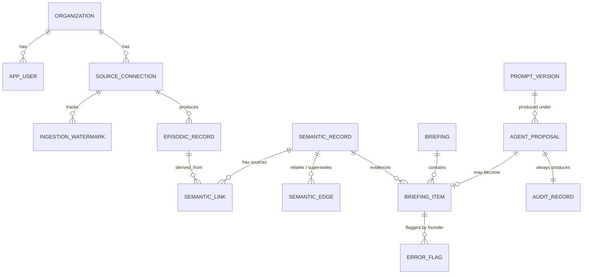

# Phase 1 — Data Model

**Date:** 2026-08-03
**Status:** Draft for critical review, per `MASTER_CONSTITUTION.md` §6

Implements the three-layer memory model from `MEMORY_ARCHITECTURE.md` on Postgres per `ADR-0002`, with tenant scoping per `ADR-0005`. The schema below is illustrative DDL — it specifies intent and constraints precisely enough to implement against, and is expected to be refined in review before the first migration is written.

---

## 1. Design commitments

Five constitutional requirements are enforced by the schema itself rather than by application code. This distinction is the point of the whole document: a rule enforced by a constraint holds under a bug, and a rule enforced by discipline does not.

| Requirement | Source | Enforcement |
|---|---|---|
| Tenant isolation | `ADR-0005` | `org_id` non-null on every table + RLS policy |
| Provenance on every record | `MEMORY_ARCHITECTURE.md` | Non-null `created_by_kind`, `created_by_id`, `created_at`, source columns |
| No orphan semantic records | `MEMORY_ARCHITECTURE.md` | Required `derived_from` edge, verified by trigger |
| Supersession, not deletion | `MEMORY_ARCHITECTURE.md` | `superseded_by` + validity window; `REVOKE DELETE` |
| Audit is append-only | `ADR-0002`, `OBSERVABILITY.md` | `REVOKE UPDATE, DELETE` on the audit table |

## 2. Conceptual shape



## 3. Foundation

```sql
-- Enable once per database.
create extension if not exists "vector";
create extension if not exists "pgcrypto";

-- ---------------------------------------------------------------
-- Tenancy. One row in Phase 1; the column exists on everything so
-- Phase 4 needs no migration (ADR-0005).
-- ---------------------------------------------------------------
create table organization (
  id          uuid primary key default gen_random_uuid(),
  name        text not null,
  created_at  timestamptz not null default now()
);

create type user_role as enum ('owner', 'admin', 'member', 'viewer');

create table app_user (
  id          uuid primary key default gen_random_uuid(),
  org_id      uuid not null references organization(id),
  email       citext not null,
  role        user_role not null,
  created_at  timestamptz not null default now(),
  unique (org_id, email)
);
```

Roles exist in Phase 1 with a single `owner` even though nothing branches on them yet. They are the RBAC skeleton `SECURITY_STANDARDS.md` requires, and having the enum present means Phase 2 adds behavior rather than a column.

## 4. Provenance

Provenance is not a convention here; it is a set of non-null columns that every record-bearing table includes. `MEMORY_ARCHITECTURE.md` requires knowing who or what created each record, when, and from what source.

```sql
create type actor_kind as enum ('human', 'agent', 'system');
```

Every episodic, semantic, procedural, and audit table carries:

| Column | Meaning |
|---|---|
| `created_by_kind` | `actor_kind` — human, agent, or automated system |
| `created_by_id` | `app_user.id`, an agent contract identifier, or a process name |
| `created_at` | when the record was written |

## 5. Source connections and watermarks

```sql
create type source_system as enum ('gmail', 'gcal', 'voice', 'slack');

create table source_connection (
  id            uuid primary key default gen_random_uuid(),
  org_id        uuid not null references organization(id),
  system        source_system not null,
  display_name  text not null,
  -- Credential *reference*, never a credential. Secrets live in the
  -- secrets manager and are fetched by name (SECURITY_STANDARDS.md).
  secret_ref    text not null,
  enabled       boolean not null default true,
  config        jsonb not null default '{}',   -- e.g. opted-in Slack channels
  created_at    timestamptz not null default now(),
  unique (org_id, system, display_name)
);

create table ingestion_watermark (
  id                    uuid primary key default gen_random_uuid(),
  org_id                uuid not null references organization(id),
  source_connection_id  uuid not null references source_connection(id),
  -- Opaque per-source cursor: Gmail historyId, calendar syncToken,
  -- timestamp, etc. The pipeline never interprets it; the adapter does.
  cursor                text,
  last_run_at           timestamptz,
  last_success_at       timestamptz,
  consecutive_failures  int not null default 0,
  unique (source_connection_id)
);
```

```sql
-- Checked by the normalizer before writing any episodic record.
--
-- This is what makes a data subject's objection or restriction request
-- meaningful (PRIVACY_MODEL.md §6). Without it, erasure is futile:
-- the record is deleted today and re-ingested on the next run, because
-- the source system still holds the message. Deletion without
-- suppression is a loop, not a remedy.
create table ingestion_suppression (
  id           uuid primary key default gen_random_uuid(),
  org_id       uuid not null references organization(id),
  -- Email address or platform identifier. Hashed, because a plaintext
  -- list of people who asked not to be processed is itself sensitive
  -- personal data, and storing it defeats its own purpose.
  identifier_hash bytea not null,
  reason       text not null,
  created_by   uuid not null references app_user(id),
  created_at   timestamptz not null default now(),
  unique (org_id, identifier_hash)
);
```

`secret_ref` is a name, never a value. A schema that *can* hold a credential eventually will, and then it is in every backup — so the column that would have held it does not exist.

The watermark advances only past fully-processed data (`ARCHITECTURE.md` §4). `consecutive_failures` drives alerting: a source that has failed repeatedly is silently producing an incomplete briefing, which is a correctness problem disguised as an availability problem.

## 6. Episodic layer — raw events

High volume, append-mostly, medium retention. One table with a discriminated payload rather than four tables, because the pipeline treats all sources uniformly and per-source columns would fork the ingestion path — the opposite of what `ADR-0006`'s shared adapter interface is for.

```sql
create type episodic_kind as enum (
  'email_message', 'calendar_event', 'call_transcript', 'slack_thread'
);

create table episodic_record (
  id                    uuid primary key default gen_random_uuid(),
  org_id                uuid not null references organization(id),
  source_connection_id  uuid not null references source_connection(id),
  kind                  episodic_kind not null,

  -- Idempotency: re-running ingestion over any window is always safe.
  source_id             text not null,

  occurred_at           timestamptz not null,  -- when it happened
  ingested_at           timestamptz not null default now(),

  -- Validated payload. Shape per kind, enforced at the trust boundary
  -- by runtime schema validation before insert (ARCHITECTURE.md §4).
  payload               jsonb not null,

  -- Participants, denormalized for querying without parsing payload.
  participants          text[] not null default '{}',

  -- ASR / extraction confidence where the source provides it. Low
  -- confidence excludes downstream facts from the briefing rather
  -- than hedging them (PRD.md A3).
  source_confidence     numeric(3,2),

  content_hash          bytea not null,  -- change detection on re-fetch

  created_by_kind       actor_kind not null,
  created_by_id         text not null,

  unique (org_id, source_connection_id, source_id)
);

create index on episodic_record (org_id, occurred_at desc);
create index on episodic_record (org_id, kind, occurred_at desc);
create index on episodic_record using gin (participants);
```

The unique constraint on `(org_id, source_connection_id, source_id)` is what makes ingestion idempotent at the database rather than in application logic, and is why the rollback strategy for a bad ingestion run is simply to re-run it.

`payload` is `jsonb` deliberately. Per-kind payloads differ substantially and are validated at the boundary; imposing four column sets here would force the normalizer to branch per source and defeat the uniform pipeline.

## 7. Semantic layer — distilled knowledge

Lower volume, long retention, deduplicated, linked, superseded rather than deleted. This is the compounding asset.

```sql
create type semantic_kind as enum (
  'commitment',      -- someone owes someone something
  'decision',        -- a choice made, with rationale
  'open_question',   -- unresolved, needs an answer
  'person',
  'project',
  'topic'
);

create table semantic_record (
  id                uuid primary key default gen_random_uuid(),
  org_id            uuid not null references organization(id),
  kind              semantic_kind not null,

  -- Human-readable claim. The thing a briefing item would say.
  statement         text not null,

  -- Kind-specific structure: commitment owner/due date, decision
  -- rationale and alternatives, call intelligence per MASTER §13.
  attributes        jsonb not null default '{}',

  -- Deduplication key. The Knowledge Manager computes a normalized
  -- identity for the claim and checks it before writing, so "never
  -- create duplicate knowledge" is enforced, not merely intended.
  dedupe_key        text not null,

  confidence        numeric(3,2) not null,

  -- Validity window. Supersession never deletes (MEMORY_ARCHITECTURE.md).
  valid_from        timestamptz not null default now(),
  valid_until       timestamptz,
  superseded_by     uuid references semantic_record(id),

  embedding         vector(1536),   -- pgvector; beside its provenance

  created_by_kind   actor_kind not null,
  created_by_id     text not null,
  created_at        timestamptz not null default now(),

  -- A superseded record must have a closed validity window. The
  -- converse deliberately does not hold: a fact may expire with no
  -- successor — a commitment whose deadline simply passes — so
  -- valid_until may be set while superseded_by stays null.
  constraint supersession_closes_validity check (
    superseded_by is null or valid_until is not null
  )
);

-- Claim identity is unique among *open current* records only.
--
-- A table-wide unique (org_id, dedupe_key) would be wrong, and wrong in
-- a way that fails on the very first supersession: a supersession chain
-- shares one claim identity by definition, so the successor would
-- collide with its own predecessor. Scoping the index to open records
-- expresses the actual rule — at most one live version of a claim —
-- while leaving the historical chain intact. Same pattern as
-- one_active_prompt_per_agent in §8.
create unique index one_open_record_per_claim
  on semantic_record (org_id, dedupe_key)
  where superseded_by is null and valid_until is null;

create index on semantic_record (org_id, kind)
  where superseded_by is null;
create index on semantic_record
  using hnsw (embedding vector_cosine_ops);
```

Two constraints deserve attention. The partial unique index on `dedupe_key` turns the no-duplicates rule into something the database refuses rather than something the Knowledge Manager remembers, without breaking supersession. And `supersession_closes_validity` prevents the specific half-state where a record has been pointed forward but still reads as currently valid — an inconsistency that would silently produce contradictory briefing items.

### Links to sources — mandatory

```sql
create table semantic_link (
  id                   uuid primary key default gen_random_uuid(),
  org_id               uuid not null references organization(id),
  semantic_record_id   uuid not null references semantic_record(id),
  episodic_record_id   uuid not null references episodic_record(id),
  created_at           timestamptz not null default now(),
  unique (semantic_record_id, episodic_record_id)
);
```

`MEMORY_ARCHITECTURE.md` treats orphan records as a data-quality defect, and `PRD.md` B2 forbids any briefing item without evidence. Enforced by a deferred constraint trigger requiring at least one `semantic_link` per `semantic_record` at transaction commit — insert-time enforcement is impossible since the record must exist before it can be linked, but commit-time enforcement is exact.

### Links between records

```sql
create type edge_kind as enum (
  'relates_to', 'supersedes', 'blocks', 'about_person',
  'about_project', 'answers'
);

create table semantic_edge (
  id          uuid primary key default gen_random_uuid(),
  org_id      uuid not null references organization(id),
  from_id     uuid not null references semantic_record(id),
  to_id       uuid not null references semantic_record(id),
  kind        edge_kind not null,
  created_at  timestamptz not null default now(),
  unique (from_id, to_id, kind),
  constraint no_self_edge check (from_id <> to_id)
);
```

Traversal uses recursive CTEs. This is why `ADR-0002` rejected a separate graph store: the graph is small and shallow, and Postgres handles it natively.

## 8. Procedural layer — prompts, rules, and feedback

Tiny, permanent, versioned. This is the layer the Phase 3 learning loop reads and writes.

```sql
create table prompt_version (
  id              uuid primary key default gen_random_uuid(),
  org_id          uuid not null references organization(id),
  agent_id        text not null,          -- agent contract identifier
  version         int not null,
  body            text not null,
  rationale       text not null,          -- why this differs from the last
  activated_at    timestamptz,
  deactivated_at  timestamptz,
  created_by_kind actor_kind not null,
  created_by_id   text not null,
  created_at      timestamptz not null default now(),
  unique (org_id, agent_id, version)
);

-- At most one active version per agent, enforced by the database
-- rather than by deployment discipline.
create unique index one_active_prompt_per_agent
  on prompt_version (org_id, agent_id)
  where deactivated_at is null and activated_at is not null;
```

`rationale` is non-null because `CONTINUOUS_IMPROVEMENT.md` requires every hypothesis to state the failure pattern it targets. A prompt change with no stated reason cannot be evaluated against its intent later.

The founder's "this was wrong" signal (`PRD.md` B3) also belongs to this layer, but its table references `briefing_item` and so is defined in §10 alongside it. Migration order is briefing tables before `error_flag`; the document's layer-by-layer ordering is for reading, not for execution.

## 9. Agent proposals and audit

The gate is the only path from proposal to effect, and it writes the audit record (`ARCHITECTURE.md` §5). These two tables are that boundary made durable.

```sql
-- What kind of effect a proposal would have. Deliberately NOT including
-- 'high_impact': high impact is orthogonal to reversibility, and an
-- enum forces a false choice. Deleting a customer record is both
-- irreversible and high-impact per MASTER_CONSTITUTION.md §11, and a
-- flat enum would make it declarable as only one of those.
create type impact_class as enum (
  'observation', 'recommendation', 'draft',
  'reversible_action', 'irreversible_action'
);

create type gate_disposition as enum (
  'logged', 'surfaced', 'drafted', 'queued_for_approval',
  'executed', 'discarded', 'refused'
);

create table agent_proposal (
  id                  uuid primary key default gen_random_uuid(),
  org_id              uuid not null references organization(id),
  agent_id            text not null,
  prompt_version_id   uuid references prompt_version(id),

  -- Declared by the agent; the gate refuses a malformed or absent
  -- value rather than inferring one — fail closed.
  impact_class        impact_class not null,

  -- Orthogonal to impact_class. True when the proposal falls into any
  -- category MASTER_CONSTITUTION.md §11 requires approval for
  -- (financial, customer communication, legal, deletion, production
  -- deploy, customer-facing prompt change, policy, security,
  -- architecture rewrite). A high-impact proposal never reaches
  -- 'executed' at any trust level; see PERMISSION_MODEL.md.
  is_high_impact      boolean not null,

  -- Trust level asserted at gate time, not read from config later.
  trust_level         int not null check (trust_level between 0 and 5),

  payload             jsonb not null,   -- the proposed content
  rationale           text not null,    -- the model's stated reasoning
  disposition         gate_disposition not null,
  refusal_reason      text,

  created_at          timestamptz not null default now(),

  constraint refusal_has_reason check (
    disposition <> 'refused' or refusal_reason is not null
  )
);

create index on agent_proposal (org_id, created_at desc);
create index on agent_proposal (org_id, disposition)
  where disposition in ('refused', 'discarded');
```

Storing `trust_level` on the proposal rather than joining to current agent config is deliberate. An audit trail must record the authority that applied *at the time*, not the authority that applies now — otherwise raising an agent's trust level silently rewrites history.

```sql
create table audit_record (
  id             uuid primary key default gen_random_uuid(),
  org_id         uuid not null references organization(id),
  proposal_id    uuid references agent_proposal(id),
  actor_kind     actor_kind not null,
  actor_id       text not null,
  action         text not null,
  trust_level    int,
  inputs         jsonb not null,
  outputs        jsonb not null,
  rationale      text,
  approval_chain jsonb not null default '[]',
  occurred_at    timestamptz not null default now()
);

create index on audit_record (org_id, occurred_at desc);

-- Append-only at the privilege level, not by convention. The
-- application role can insert and select, nothing more.
revoke update, delete on audit_record from public;
revoke update, delete on audit_record from leap_app;
```

### Redaction without an update path

There is a genuine tension between this table being append-only and §12's requirement to redact personal data inside `inputs` and `outputs` on a data-subject erasure request. Both are real obligations: accountability requires that the record of an action survive, and privacy law requires that the personal data inside it not.

Revoking `UPDATE` from the application role and then having the application update the row would be a fiction. The resolution is that redaction is a *different operation performed by a different principal*, not an application capability:

```sql
-- Owned by a dedicated role the application cannot assume. Can only
-- overwrite designated keys with a tombstone value; cannot alter
-- actor, action, trust_level, approval_chain, or occurred_at; and
-- writes its own audit record, so redaction is itself audited.
create function redact_audit_pii(
  target_id uuid,
  keys      text[],
  reason    text
) returns void
language plpgsql
security definer
set search_path = public
as $$
begin
  update audit_record
     set inputs  = redact_keys(inputs,  keys),
         outputs = redact_keys(outputs, keys)
   where id = target_id;

  insert into audit_record (org_id, actor_kind, actor_id, action,
                            inputs, outputs, rationale)
  select org_id, 'human', current_setting('app.current_user_id'),
         'audit.redact', jsonb_build_object('target', target_id,
         'keys', keys), '{}'::jsonb, reason
    from audit_record where id = target_id;
end;
$$;
```

What survives redaction is exactly what accountability needs: that an action of a given kind occurred, at a given time, by a given actor, under a given trust level, through a given approval chain. What does not survive is the personal content the action operated on. `PRIVACY_MODEL.md` specifies which keys are redactable and what remains provable.

`OBSERVABILITY.md` requires actor, trust level, inputs, outputs, rationale, and approval chain on every agent action. `approval_chain` is empty throughout Phase 1 and present because Phase 2 fills it — adding it now costs nothing and avoids migrating the audit table, which is the one table where a migration is most awkward.

## 10. Briefings

```sql
create table briefing (
  id              uuid primary key default gen_random_uuid(),
  org_id          uuid not null references organization(id),
  recipient_id    uuid not null references app_user(id),
  briefing_date   date not null,
  generated_at    timestamptz not null default now(),
  delivered_at    timestamptz,
  opened_at       timestamptz,
  item_count      int not null,
  generation_ms   int,
  token_cost      numeric(10,4),
  unique (org_id, recipient_id, briefing_date)
);

create type briefing_section as enum (
  'priorities', 'awaiting_response', 'open_commitments',
  'calendar_today', 'calendar_tomorrow', 'call_intelligence',
  'system_health'
);

create table briefing_item (
  id             uuid primary key default gen_random_uuid(),
  org_id         uuid not null references organization(id),
  briefing_id    uuid not null references briefing(id),
  proposal_id    uuid not null references agent_proposal(id),
  section        briefing_section not null,
  rank           int not null,
  headline       text not null,
  detail         text,
  trust_level    int not null check (trust_level between 0 and 5),
  unique (briefing_id, section, rank)
);

-- Evidence. PRD.md B2: no item ships without at least one link.
create table briefing_item_evidence (
  id                  uuid primary key default gen_random_uuid(),
  org_id              uuid not null references organization(id),
  briefing_item_id    uuid not null references briefing_item(id),
  semantic_record_id  uuid references semantic_record(id),
  episodic_record_id  uuid references episodic_record(id),
  source_url          text,
  unique (briefing_item_id, semantic_record_id, episodic_record_id),
  constraint evidence_points_somewhere check (
    semantic_record_id is not null or episodic_record_id is not null
  )
);

-- The founder's "this was wrong" signal (PRD.md B3), defined here
-- rather than in §8 because it references briefing_item. Phase 1
-- collects it; Phase 3's learning loop consumes it.
create table error_flag (
  id                uuid primary key default gen_random_uuid(),
  org_id            uuid not null references organization(id),
  briefing_item_id  uuid not null references briefing_item(id),
  -- Stays NOT NULL. Anonymization per §12 repoints this at a reserved
  -- tombstone user row rather than nulling it, for the same reason
  -- redaction elsewhere writes a marker instead of NULL: "anonymized"
  -- and "never recorded" must stay distinguishable, and that
  -- distinction is itself audit-relevant.
  flagged_by        uuid not null references app_user(id),
  note              text,
  created_at        timestamptz not null default now()
);
```

`PRD.md` B3 requires the flag to record the item, its source, and the reasoning that produced it. Only `briefing_item_id` is stored, because the other two are reachable by join and duplicating them would create two versions of the same truth: `briefing_item → proposal_id → agent_proposal.rationale` gives the reasoning and the prompt version, and `briefing_item_evidence` gives every contributing source. The join is the record.

`trust_level` is denormalized onto `briefing_item` so a renderer cannot produce an item without one — `UX_PRINCIPLES.md` §1 becomes a type-level guarantee rather than a review checklist item, per `ARCHITECTURE.md` §7. The same commit-time trigger pattern used for `semantic_link` enforces at least one evidence row per item.

`generation_ms` and `token_cost` exist because cost is one of the eleven dimensions of the §19 milestone self-review, and a cost you never recorded is a cost you cannot review.

## 11. Row-Level Security

```sql
alter table episodic_record enable row level security;
-- ... every tenant-scoped table

create policy tenant_isolation on episodic_record
  using (org_id = current_setting('app.current_org_id')::uuid);
```

Applied uniformly to every table carrying `org_id`. The session variable is set by the repository layer per `ADR-0002`.

RLS is the most dangerous surface in this schema because a too-permissive policy **fails silently and looks exactly like a working system**. It therefore gets adversarial tests attempting cross-tenant reads against a synthetic second organization, not merely tests confirming legitimate reads succeed (`TESTING_STRATEGY.md`). A policy exercised only by a single tenant has never been tested.

## 12. Retention

`MEMORY_ARCHITECTURE.md` requires retention defined per category at schema-design time. Writing the schema without these is the tempting shortcut, and it is the one that turns into a compliance problem rather than a code problem.

| Table | Retention | Deletion on data-subject request |
|---|---|---|
| `episodic_record` | 400 days rolling | **Content tombstone**, not row delete — see below |
| `semantic_record` | Indefinite (the compounding asset) | Redact `statement` and `attributes`, preserve structure and links |
| `semantic_link`, `semantic_edge` | Indefinite | Preserved |
| `agent_proposal` | 7 years, matching `audit_record` | Redact `payload` and `rationale`; it is `audit_record`'s and `briefing_item`'s parent, so the row must survive |
| `audit_record` | 7 years | **Never deleted** — legal-basis retention; redact PII via `redact_audit_pii` (§9) |
| `prompt_version` | Indefinite | Not applicable |
| `briefing`, `briefing_item` | 2 years | Hard delete |
| `briefing_item_evidence` | Follows `briefing_item` | Cascades |
| `error_flag` | Indefinite | Repoint `flagged_by` at a reserved tombstone user |
| Application logs | 30 days | Not individually addressable; short retention bounds a leak we cannot fully prevent |
| Metrics, traces | 90 days | Not individually addressable |

Logs and traces are meant to carry no personal data by construction (`OBSERVABILITY_STRATEGY.md`), but the redaction rule will occasionally be violated in practice, so short retention is the control that bounds the consequence rather than the one that prevents it.

### Why episodic deletion is a tombstone, not a row delete

Hard-deleting an episodic record would break the no-orphans invariant from §7. Every `semantic_record` must retain at least one `semantic_link` to an episodic record, so deleting the last source behind a fact either fails the commit-time trigger or leaves a fact with no provenance — and a fact with no provenance cannot be explained, which violates the explainability requirement rather than satisfying a privacy one.

Erasure therefore clears content while preserving structure: `payload` is replaced with a tombstone marker, `participants` is emptied, `content_hash` is retained (it is a hash, not content), and the row and its links stay. The result is a system that can still say "this fact came from a message on this date" without retaining the message. `PRIVACY_MODEL.md` specifies the tombstone shape.

### The audit tension, stated plainly

`audit_record` must survive for accountability while data subjects have deletion rights, and both obligations are real. The resolution is redaction of personal data *within* audit records rather than removal of the records, performed by a principal the application cannot assume, and itself audited (§9). What stays provable is that an action of a given kind occurred at a given time by a given actor under a given trust level. What does not persist is the personal content it operated on.

## 13. Open questions

1. **Embedding model and dimension.** `vector(1536)` is a placeholder. Changing it later requires re-embedding everything — cheap now, expensive at volume.
2. **`episodic_record` partitioning.** Monthly range partitioning on `occurred_at` would ease the 400-day retention sweep. Deferred as premature at Phase 1 volume, but the retention job is materially simpler with it, so worth deciding before volume arrives.
3. **`dedupe_key` derivation.** The most consequential unresolved detail in the schema: too strict and memory fills with near-duplicates, too loose and distinct facts collapse into one. Needs a written specification and its own test suite before distillation ships.
4. **Encryption of `payload`.** Resolved in `PRIVACY_MODEL.md`: no column-level encryption in Phase 1, relying on at-rest encryption plus self-held backup encryption, with a Phase 4 revisit. Recorded here because the reasoning belongs with the schema.
5. **`upsertMany` conflict semantics.** `API_CONTRACTS.md` §4 now specifies that a changed `content_hash` updates the payload rather than being skipped. Worth re-reading against this schema during review, because "re-run it" as the rollback answer for a bad ingestion run depends entirely on that choice.
