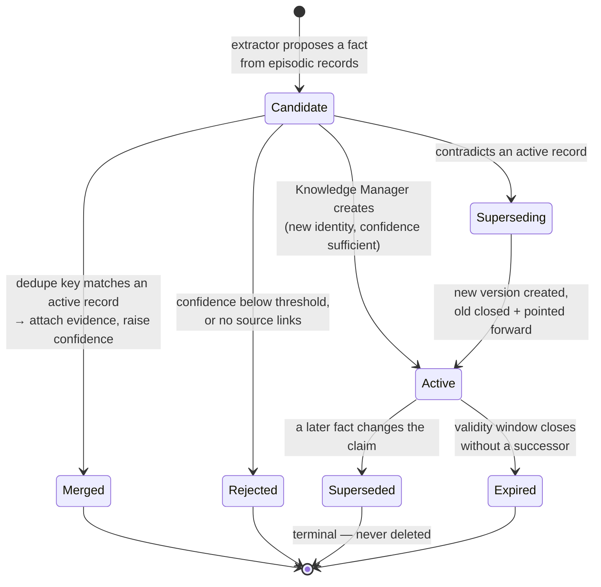
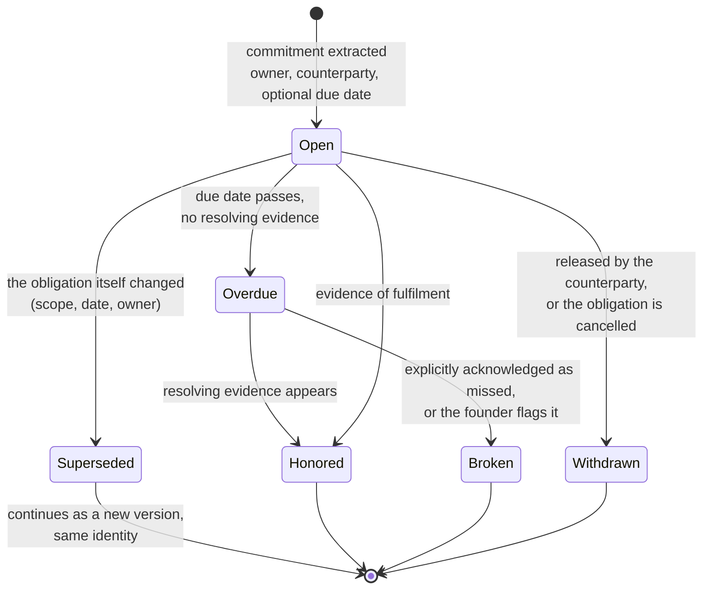
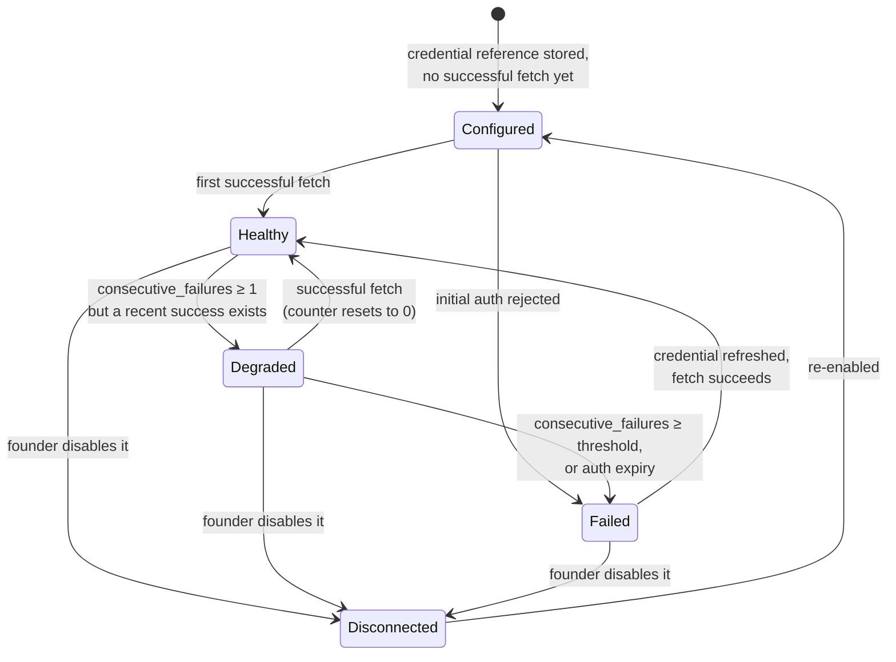
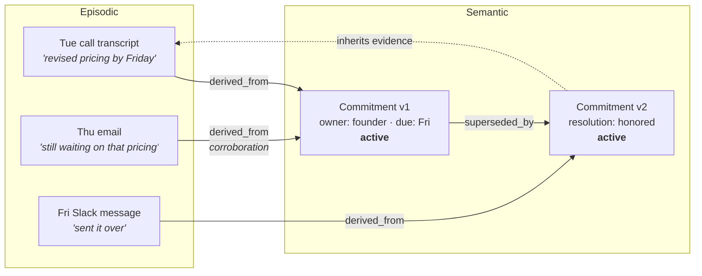

# Phase 1 — Domain Model

**Date:** 2026-08-03
**Status:** Draft for critical review, per `MASTER_CONSTITUTION.md` §6

Companion to `PRD.md` and `ARCHITECTURE.md`. This document defines the concepts; `DATA_MODEL.md` defines their storage.

---

## 1. What this document is for, and what it is not

`DATA_MODEL.md` answers "what columns, what constraints, what indexes." This document answers a prior question: **what are the things, what makes each one itself, and what states can it legitimately be in.** An engineer should be able to read this file, close it, and then read the SQL and find no surprises. If the SQL contains a concept that is not named here, one of the two documents is wrong.

The distinction is not academic. Two examples show why it earns its own file.

A Commitment is one domain object with a life history. In storage it is a *chain* of `semantic_record` rows linked by `superseded_by`, because supersession never deletes (`MEMORY_ARCHITECTURE.md`). Reading the schema alone, a reasonable engineer would conclude that a commitment whose due date changed is two commitments. It is one. That fact lives here, and nowhere in the DDL states it.

Conversely, `dedupe_key` looks like a technical field in `DATA_MODEL.md` §7. It is not. It is the *identity function of the semantic layer* and therefore the single most consequential design decision in Phase 1, because "never create duplicate knowledge" (`MASTER_CONSTITUTION.md` §12) is exactly the statement that this function is correct.

### The one sentence that governs everything

> **The model decides what to propose. Deterministic code decides what is permitted.**

Established in `ADR-0003`, restated in `ARCHITECTURE.md` §1. In domain terms it means the language model is a *producer of candidates* and never a holder of authority. Every concept below sorts cleanly onto one side of that line, and knowing which side a concept sits on tells you immediately whether it may be non-deterministic. A Proposal is generative. A Disposition is not. Confusing the two is the failure mode this whole architecture exists to prevent.

---

## 2. The ubiquitous language

These terms are used with exactly these meanings in code, in prose, in commit messages, in log event names, and in conversation. Where a synonym is tempting, the synonym is banned. Consistency here is not tidiness; a system whose vocabulary drifts produces documents that quietly disagree.

| Term | One-line definition | Layer / side of the authority line |
|---|---|---|
| **Episodic Record** | One thing that happened, captured close to verbatim, with provenance | Episodic memory |
| **Semantic Record** | One distilled claim about the world, derived from episodic records | Semantic memory |
| **Commitment** | A promise made by or to the founder, with an owner, a counterparty, and a resolution state | Semantic (kind) |
| **Decision** | A choice that was made, with its rationale and the alternatives rejected | Semantic (kind) |
| **Open Question** | A question that has been raised and not answered | Semantic (kind) |
| **Person / Project / Topic** | Entities that other semantic records attach to | Semantic (kinds) |
| **Call Intelligence** | The structured reading of one call per `MASTER_CONSTITUTION.md` §13 | Semantic, multi-record |
| **Proposal** | A single thing an agent suggests, with a declared Impact Class, rationale, and Evidence | Generative output |
| **Impact Class** | The proposal's self-declared category of consequence | Generative declaration, deterministically read |
| **Trust Level** | The authority an agent holds, 0–5 | Deterministic configuration |
| **Disposition** | What the gate decided to do with a proposal | Deterministic decision |
| **Agent Contract** | An agent's declared responsibility, trust level, tools, and escalation behaviour | Deterministic configuration |
| **Briefing** | One dated delivery to one recipient | Output |
| **Briefing Item** | One ranked, evidenced, trust-tagged statement inside a Briefing | Output |
| **Evidence** | The specific records and source links behind an item or proposal | Cross-cutting |
| **Provenance** | Who or what created a record, when, and from what source | Cross-cutting |
| **Supersession** | Replacing a claim by closing it and pointing forward, never deleting | Semantic lifecycle |
| **Dedupe Key** | The normalized identity of a claim; the semantic layer's identity function | Semantic identity |
| **Watermark** | How far a Source Connection has been fully processed | Ingestion |
| **Source Connection** | One configured, credentialed link to one external system | Ingestion |
| **Error Flag** | The founder's assertion that a Briefing Item was wrong | Procedural |

### 2.1 Terms that need discrimination

The definitions above are cheap. The distinctions below are the ones that get violated in practice.

**Episodic Record vs. Semantic Record.** An episodic record is a *record of an utterance or occurrence*: this email arrived, this meeting was on the calendar, this call was transcribed. It makes no claim about truth beyond "this is what the source said." A semantic record is a *claim*: Aaron owes Dana a pricing document by Friday. The episodic record can be wrong only by being a bad copy. The semantic record can be wrong by being a bad reading of a good copy, which is why it carries confidence and the episodic record carries only *source* confidence.

Commonly confused with: a summary. A summary of an email thread is not a semantic record. Semantic records are individually addressable claims with their own identity and lifecycle; "here is what this thread was about" has neither. If a candidate fact cannot be superseded by a later contradicting fact, it is prose, not a semantic record, and it does not belong in the semantic layer.

**Provenance vs. Evidence.** Provenance is about the *record*: who wrote it, when, from where. It is mandatory on everything and it exists for accountability. Evidence is about a *claim shown to the founder*: these are the specific things that make this item true, and here is how to go look at them. Provenance answers "how did this row get here." Evidence answers "why should I believe you." Every record has provenance. Only surfaced things need evidence. They are frequently conflated because in the common case the same episodic record satisfies both, and conflating them means the day a briefing item derives from three sources, two of them get dropped from the email (`PRD.md` B2 forbids exactly this).

**Impact Class vs. Trust Level.** The Impact Class is a property of the *proposal*: how consequential is this thing being suggested. The Trust Level is a property of the *agent*: how much authority does the suggester hold. The gate is a function of both plus policy, and neither alone determines an outcome. A recommendation from a Trust 0 agent is discarded; the same recommendation from a Trust 1 agent is surfaced (`ARCHITECTURE.md` §5). The model declares the former and can never declare the latter.

Commonly confused with: severity or priority. Impact Class is not "how important is this," it is "what kind of consequence would acting on this have." An urgent recommendation and a trivial recommendation are the same Impact Class. Priority is expressed by `rank` within a Briefing section, and the two must never be collapsed, because the gate reads Impact Class and must not become sensitive to how urgent the model sounded.

**Disposition vs. outcome.** A Disposition is the gate's decision, recorded on the proposal, immutable, and one of the seven values in `GateDisposition` (`API_CONTRACTS.md` §6). It is not whether the founder liked the item, not whether delivery succeeded, and not whether the recommendation turned out to be correct. Those are later facts about a different object. `refused` and `discarded` are distinct and the distinction matters: **discarded** means well-formed but not permitted to surface at this trust level, **refused** means the proposal was malformed or exceeded its authority, and refusal alerts a human (§5.3 below).

**Supersession vs. update vs. deletion.** There is no update path for a claim and no deletion path at all (`MEMORY_ARCHITECTURE.md`, `DATA_MODEL.md` §1). When the world changes, the old claim gets a closed validity window and a forward pointer, and a new claim takes its place in the present. The consequence engineers must internalize: **querying the semantic layer without filtering to the active version returns history as if it were the present.** Every read path that feeds a briefing filters on `superseded_by is null`. A read path that forgets is not a performance bug, it is a correctness bug that produces a confidently contradictory briefing.

**Dedupe Key vs. primary key.** The primary key identifies a *row*. The Dedupe Key identifies a *claim*, and one claim may span many rows across its supersession history. This is the crux of §6 below.

**Watermark vs. last-run timestamp.** A watermark is a claim about *completeness*: everything before this cursor has been fully processed into the episodic layer. A last-run timestamp is a claim about *activity*: the job executed. A run that fetched fifty events and wrote forty-eight updates the timestamp and must not advance the watermark (`ARCHITECTURE.md` §4). Treating them as the same field is the single easiest way to lose data permanently and silently, which is why `IngestOutcome.safeToAdvanceCursor` exists as its own boolean (`API_CONTRACTS.md` §3).

**Agent Contract vs. prompt.** The contract is the declaration the deterministic layer reads: responsibility, trust level, permitted tools, escalation behaviour. The prompt is the text the model reads. Tools come from the contract at construction and are absent from the runtime if not declared, so a prompt cannot widen an agent's authority no matter what it says or what injected text convinces it of (`ADR-0003`). A prompt is versioned in the procedural layer and can change weekly. A contract change is a security change under `MASTER_CONSTITUTION.md` §11.

---

## 3. Aggregates and their boundaries

An aggregate here means what it usually means: a cluster of concepts with one entry point, one consistency boundary, and invariants that must hold whenever a transaction commits. Phase 1 has six. Naming them matters because the boundaries tell you which invariants can be enforced transactionally and which can only be enforced eventually.

| Aggregate | Root | Contains | Invariants that hold at commit |
|---|---|---|---|
| **Source Connection** | `SourceConnection` | Watermark, credential reference, source config | Exactly one watermark per connection; the credential is a reference, never a value |
| **Episodic Record** | `EpisodicRecord` | Validated payload, participants, source confidence | Unique per `(org, connection, source_id)`; provenance complete; payload schema-valid |
| **Semantic Claim** | `SemanticRecord` (the active version) | Source links, outgoing edges, attributes, confidence, validity window | At least one source link; supersession is complete or absent; identity equals the dedupe key |
| **Proposal** | `AgentProposal` | Impact class, rationale, evidence refs, disposition, applied trust level | Exactly one disposition; refusals carry a reason; the audit record is written in the same transaction |
| **Briefing** | `Briefing` | Sections, items, per-item evidence | Every item has a trust level and at least one evidence link; no empty sections; ranks unique within a section |
| **Procedural Knowledge** | `PromptVersion`, `ErrorFlag`, priority rules | Version history, rationale | At most one active prompt version per agent; a version states why it differs from the last |

Three boundary decisions carry weight.

**The Semantic Claim aggregate does not include the episodic records it derives from.** The link is mandatory, but the episodic record has its own lifecycle and its own retention (400 days rolling, `DATA_MODEL.md` §12) while claims are kept indefinitely. This is a deliberate asymmetry and it has a consequence nobody should discover late: **a claim can outlive its evidence.** Once the episodic record behind a two-year-old commitment has aged out, the claim remains but its drill-down link is dead. Phase 1's briefing only reasons over recent windows so this does not bite yet. It will, and §9 records it.

**The Proposal aggregate includes its audit record.** Not by convention but because the gate is the only path from proposal to effect and the gate writes the audit record, so authorizing and logging are the same operation (`ARCHITECTURE.md` §5). Putting them in one aggregate means "an unlogged effect" is not a state the system can be in, rather than a state it tries hard to avoid.

**A Briefing is a snapshot, not a view.** Items are materialized with their headline, detail, trust level, and evidence at generation time. They are not recomputed on read. If a commitment is superseded at noon, this morning's briefing still says what it said this morning. That is correct: the briefing is a record of what the founder was told, which is the object the Error Flag attaches to and the object the Phase 3 learning loop scores. A briefing that silently rewrote itself would make every flag unfalsifiable.

---

## 4. Invariants, stated as domain rules

These are the rules an engineer must hold in their head. Each one is enforced somewhere in `DATA_MODEL.md` or `API_CONTRACTS.md`, but the rule is prior to the enforcement, and where enforcement is currently incomplete that is a defect in the enforcement, not a softening of the rule.

**I1. Every semantic record has at least one source.** A claim with no episodic origin is an assertion the system invented, and there is no legitimate way for that to occur. `MEMORY_ARCHITECTURE.md` calls orphans a data-quality defect; in this domain they are stronger than that, they are fabrications. Expressed as a missing method: there is no way to create a semantic record without links (`API_CONTRACTS.md` §4).

**I2. Every record names its origin.** Provenance is who or what, when, and from where, on episodic, semantic, procedural, and audit records alike. A record whose creator is unknown cannot be evaluated when it turns out to be wrong, which makes the whole continuous-improvement premise unavailable.

**I3. A superseded claim has both a forward pointer and a closed validity window.** Never one without the other. The half-state, where a record points forward but still reads as currently valid, produces two active claims that contradict each other and therefore a briefing that contradicts itself in two adjacent bullets. This is the specific failure the founder's trust posture in `PRD.md` §6 does not survive.

**I4. No two active claims share an identity.** Two active records with the same dedupe key means the system holds the same knowledge twice, and the next fact that should update one of them will update the wrong one. This is "never create duplicate knowledge" stated precisely enough to test.

**I5. A claim is never deleted.** Not by the Knowledge Manager, not by an agent, not by a repository method, because no such method exists. Correction happens by supersession. Removal happens only through the retention and data-subject-request paths, which redact content while preserving structure and links (`DATA_MODEL.md` §12).

**I6. A proposal declares its own Impact Class, and a proposal without a well-formed one is refused.** Fail closed. The gate never infers an impact class from prose, because inferring it would make the gate's behaviour depend on the model's phrasing and would hand the model a way to argue its way upward.

**I7. A proposal cites evidence, and a proposal with no evidence is never surfaced.** An unsourced assertion is not shippable at any trust level (`PRD.md` B2). Note the ordering: evidence is required *before* the gate permits surfacing, not attached afterward by the composer. A composer that could add evidence would be a composer that could invent it.

**I8. Every briefing item carries a Trust Level.** Carried as data on the item so that no renderer can omit it (`UX_PRINCIPLES.md` §1, enforced at the type level per `ARCHITECTURE.md` §7). In Phase 1 the label reads "Recommendation" on every item, which is not redundant — it establishes the vocabulary before higher trust levels exist (`ADR-0004`).

**I9. Low confidence excludes, it does not hedge.** A claim below the confidence threshold is not surfaced with a qualifier. It is left out. Hedged language transfers the judgment back to the founder, which is precisely the cognitive load Phase 1 exists to remove, and it is how a system trains a reader to distrust everything it says.

**I10. Absent confidence is not low confidence.** Gmail does not report a confidence score; a transcript provider does. Conflating "not reported" with zero would silently exclude all email, and conflating it with certainty would silently promote bad ASR (`API_CONTRACTS.md` §2). The absence must remain representable all the way through distillation.

**I11. No agent acts above its declared trust level, even when technically capable.** `AI_AGENT_STANDARDS.md` states it; the domain consequence is that trust level is an attribute of the *actor at the moment of the decision*, recorded on the proposal, never re-derived later from current configuration. Raising an agent's trust level tomorrow must not retroactively change what authorized an action today.

**I12. Related knowledge is linked.** A commitment made in a call links to the person who is its counterparty, to the project it serves, and to the decision that created it, where those exist. Linking is not enrichment; an unlinked commitment is invisible to every retrieval path that starts from a person or a project, and so it exists without being findable.

---

## 5. Lifecycles

### 5.1 Semantic Record

Four things about this diagram are load-bearing.

**Candidate is not a stored state.** A candidate fact (`CandidateFact`, `API_CONTRACTS.md` §4) exists only in memory between the extractor and the Knowledge Manager. Nothing untrusted is ever written into the semantic layer and cleaned up later. The reconcile step is the gate for the semantic layer in the same way the trust gate is the gate for actions: the generative component proposes, deterministic code decides. That parallel is intentional and it is the reason the Knowledge Manager is a separate module rather than part of the extractor.

**Merged is by far the most common outcome, and that is the point.** In a working system, most extracted facts are restatements of things already known. A distillation run whose reconcile outcome is mostly `created` is evidence that the dedupe key is too strict, not evidence of productivity. This ratio is the cheapest available health metric for the semantic layer and it should be monitored from the first week.

**Expired and Superseded are different.** A commitment whose due date passes without resolution does not become superseded; it becomes *overdue*, which is a highly briefable state and one of the most valuable things Phase 1 can say. Expiry applies to claims that were true for a bounded window and simply stopped being relevant. Do not model overdue as expiry.

**Rejected leaves no trace in the semantic layer**, but the rejection is reported in `ReconcileOutcome.rejected` and should be logged. A fact rejected for low confidence every day for a week is a signal about either the source or the extractor, and it is invisible if rejection is silent.

### 5.2 Proposal

```mermaid
stateDiagram-v2
    [*] --> Produced: agent emits a proposal<br/>(generative; may be anything)
    Produced --> Gated: reaches the trust gate<br/>(the only path onward)
    Gated --> Surfaced: impact class permitted<br/>at this trust level
    Gated --> Logged: impact class = observation
    Gated --> Discarded: well-formed but not<br/>permitted to surface
    Gated --> Refused: malformed, unevidenced,<br/>or above trust level
    Surfaced --> Composed: composer places it<br/>in a BriefingDocument
    Composed --> Delivered: renderer + delivery
    Refused --> [*]: logged AND alerted
    Discarded --> [*]: logged
    Logged --> [*]
    Delivered --> [*]
```

Every transition out of `Gated` writes an audit record, including the ones that go nowhere. A proposal that was refused is one of the more interesting records in the system (§5.3 of `WORKFLOWS.md`), and one that was discarded is the raw material of the Phase 3 learning loop, since it captures what the agent thought was worth saying and policy prevented.

Note the transition that does not exist: there is no arrow from `Produced` to `Composed`. The composer takes gate output, never agent output. `ADR-0004` names the temptation to skip the intermediate structured object; this is the same shortcut viewed from the authority side, and it is worse here, because bypassing the gate rather than the document type removes a guarantee rather than an abstraction.

`Surfaced` and `Composed` are separate states because a surfaced proposal can still fail to reach a briefing: the composer applies the item-count discipline and section rules from `ARCHITECTURE.md` §7. Gate permission is necessary, not sufficient.

### 5.3 Commitment resolution

`Overdue` is a *derived* state, not a stored one. It is computed as "open and past due," which means it needs no job to maintain and cannot go stale. Storing it would require a sweeper, and a sweeper that fails produces commitments that are overdue in reality and open in the database, which is exactly the failure the founder would notice first.

The transition to `Honored` deserves scepticism, and Phase 1 should be conservative about it. At Trust Levels 0–1 the system observes; it does not receive confirmations. Fulfilment is inferred from evidence such as an email that appears to send the promised document. Inference is fallible, and a commitment wrongly marked honored disappears from the briefing, which is a *silent* error and therefore worse than a wrongly-retained one. The domain rule: **resolution to `Honored` requires confidence above the surfacing threshold; below it, the commitment stays open and the briefing may note that it looks addressed.** An over-eager honored inference is the most plausible route to failing `PRD.md`'s zero-misleading-recommendations criterion by omission rather than by assertion, and omission is the harder failure to detect.

### 5.4 Source Connection

The domain rule that makes this lifecycle matter: **a briefing generated while a source is Degraded or Failed states the gap.** A source that has been failing for six hours is silently producing an incomplete briefing, which `DATA_MODEL.md` §5 correctly identifies as a correctness problem disguised as an availability problem. The founder reading a briefing with no calls in it must be able to distinguish "no calls yesterday" from "the transcript source has been down since Tuesday." Without that distinction, an outage teaches the founder that the system is wrong about calls, and `ADR-0006` is explicit that this belief is expensive to reverse.

`Degraded` and `Failed` are separated on purpose. Degraded is normal operational noise: a rate limit, a transient 5xx, and the next run recovers. It should not alert and it should not appear in the briefing. Failed means human intervention is required. Collapsing them produces either alert fatigue, which `UX_PRINCIPLES.md` names as directly undermining the trust framework, or an outage nobody notices.

---

## 6. The Commitment, in depth

Commitment is the highest-value domain object in Phase 1. `PRD.md` §1 lists the failures the phase targets and the first is a commitment made on a call on Tuesday that was not honoured because it lived only in the call. Everything else the briefing does is available, with effort, from the source systems. Cross-source commitment tracking is not.

### 6.1 Definition

A Commitment is **an obligation, created by something someone said, held by an owner toward a counterparty, optionally due at a time, currently in a resolution state.**

| Facet | Meaning | Notes |
|---|---|---|
| Owner | Who must act | The founder, or someone else. Both directions are in scope. |
| Counterparty | Who is owed | May be a person, or a group where the promise was made to a channel or a meeting. |
| Obligation | What is owed | The normalized predicate. This is the part that is hard, see §6.3. |
| Due | When, if stated | Optional and frequently vague. "Early next week" is a window, not a timestamp. |
| Resolution | Open, honored, broken, withdrawn | Per §5.3. Overdue is derived. |
| Evidence | Every episodic record that establishes or reinforces it | Grows over the commitment's life. |
| Confidence | How sure the system is that this obligation exists | Distinct from confidence about resolution. |

Two directions matter equally and are easy to under-model. "What I owe" is the obvious one. "What I am owed" is the one a chief of staff is actually valuable for, because the founder is already anxious about their own promises and has no system at all for other people's.

### 6.2 One commitment, not two

Take the concrete case. On Tuesday, on a call, the founder says: "I'll get you the revised pricing by Friday." On Thursday, in an email thread, someone writes: "still waiting on that pricing you mentioned."

Naive extraction produces two facts. Two facts produce two briefing items, which is a duplicate to the founder, and worse, it means neither item has the full picture: the first knows the deadline, the second knows the counterparty is now chasing.

The correct model is **one Commitment with two pieces of evidence.** Concretely, on Thursday the Knowledge Manager:

1. Computes the candidate's dedupe key and finds it matches an active commitment.
2. Adds a `semantic_link` from that existing commitment to the Thursday email's episodic record.
3. Raises confidence, because independent corroboration from a different source is genuine evidence that the obligation is real.
4. Updates nothing about the obligation itself, because nothing about it changed.

The briefing then has one item that can say something neither source could say alone: this is due tomorrow, and the counterparty has already followed up. That sentence is the product.

Note what the diagram shows about identity. `C1` and `C2` are two rows and one Commitment. The Friday Slack message did not create a second obligation; it changed the resolution state of the existing one, which is a supersession, which produces a new version of the same claim. The Commitment's identity is its dedupe key. The row is a version of it.

### 6.3 The three outcomes reconcile must distinguish

Everything above depends on the Knowledge Manager making a three-way distinction correctly. This is the hardest judgment in Phase 1.

| Relationship | Correct action | Failure if wrong |
|---|---|---|
| **Same obligation, new evidence** | Link, raise confidence, change nothing else | Duplicate items in the briefing; neither item complete |
| **Same obligation, changed detail** (date moved, scope narrowed, owner reassigned) | Supersede: close v1, create v2, carry evidence forward | Either a stale deadline surfaced as current, or the history of the change lost |
| **Different obligation** | Create a new commitment | Two real promises collapse into one and one of them is silently dropped |

The two error directions are not symmetric and Phase 1 should not treat them as equally bad. A false split produces a visible duplicate, which the founder notices, flags, and which costs credibility but is self-correcting. A false merge produces a **silently dropped promise**, which is indistinguishable from the system working and is the exact failure `PRD.md` §1 opens with. Therefore the dedupe key should err strict, and a duplicate-detection pass over near-neighbours should catch what strictness splits. Preferring the loud error over the quiet one is the general principle and it applies throughout this system.

Note the tension with `DATA_MODEL.md` §7, which enforces `unique (org_id, dedupe_key)` across the whole table. If two rows in a supersession chain share an identity — which §6.2 says they do, since that is what identity means — that constraint cannot hold as written. It needs to be scoped to active records only. Recorded in §9.

### 6.4 What a dedupe key for a commitment must and must not include

Not a specification, but the constraints that specification must satisfy. `DATA_MODEL.md` §13 already names dedupe-key derivation as the most consequential unresolved detail in the schema; these are the domain requirements it has to meet.

Must be insensitive to: the source it came from, the exact wording, the speaker's phrasing versus the writer's, and tense. Tuesday's "I'll send pricing" and Thursday's "the pricing you owe me" must produce the same key or §6.2 does not work.

Must be sensitive to: owner, counterparty, and the obligation's object. "I'll send Dana the pricing" and "I'll send Dana the contract" are two commitments. "I'll send Dana the pricing" and "I'll send Marcus the pricing" are two commitments.

Must *not* include: the due date, or resolution state. Both change over the commitment's life, and including either in its identity would make a rescheduled commitment a different commitment, which breaks supersession at the exact moment supersession is what you want.

---

## 7. Call Intelligence as a domain concept

`MASTER_CONSTITUTION.md` §13 requires that every call produce structured intelligence: transcript, intent, outcome, objections, sentiment, transfer quality, booking quality, missed opportunities, prompt failures, recommended improvements, with every recommendation measurable. `ADR-0006` observes that §13 is more prescriptive than anything in the email path and reads that as a signal about where the commercial core sits.

The modelling question is what kind of thing this is. It is tempting to treat "call intelligence" as one object: a per-call analysis record. That is wrong, and getting it wrong forecloses the thing that makes it valuable.

**A call's intelligence is a set of semantic records sharing one episodic origin, not a single analysis blob.** The reason is compounding. An objection raised on three calls in a week is a pattern, and `PRD.md` §1 lists exactly that failure: "a pattern across three customer conversations goes unnoticed because no single conversation contained it." A pattern across calls requires that the objection be an addressable, dedupable, linkable claim. Sealed inside a per-call JSON summary it is searchable text and nothing more, and the third occurrence looks exactly like the first.

Mapping, per §13 facet:

| §13 facet | Domain representation | Dedupe behaviour |
|---|---|---|
| Transcript | Episodic record, `call_transcript` | By source id; never deduplicated against other calls |
| Intent | Attribute on the call's episodic record | Per call, not a claim about the world |
| Outcome | Attribute on the episodic record; plus a `decision` record if a choice was made | Decisions dedupe normally |
| Objections | One `topic` record per distinct objection, linked to person and project | **Deduped across calls.** The third occurrence merges and raises confidence, and that is the pattern surfacing. |
| Sentiment | Attribute on the episodic record, and on the `person` record as a trend | Trend is derived at read time, not stored |
| Missed opportunities | `open_question` records | Deduped; a repeatedly missed opportunity is a strong briefing item |
| Commitments made on the call | `commitment` records per §6 | Deduped across all sources; this is §6.2 |
| Transfer / booking quality | Attributes on the episodic record | Phase 1 captures; Phase 3 scores |
| Prompt failures, recommended improvements | Procedural layer, not semantic | Out of Phase 1 scope beyond capture; see §8 |

The split is principled and worth stating as a rule: **facts about the call go on the episodic record; claims about the world go in the semantic layer.** Intent is a fact about the call. An objection is a claim about a customer's position, and it outlives the call. Sentiment sits awkwardly on the boundary, which is why Phase 1 records it as a per-call attribute and derives trends rather than storing a sentiment claim. Storing a sentiment claim would mean superseding it after every call, and a supersession chain of one hundred sentiment readings is a time series wearing the wrong clothes.

Two Phase 1 constraints on all of this. Low-confidence facts are excluded, not hedged (I9), and ASR error plus speaker misattribution make transcripts the source most likely to produce confident nonsense (`ADR-0006`). And §13's "every recommendation must be measurable" is only *instrumented* in Phase 1; measurement requires scored outcomes at volume, which is Phase 3 (`PRD.md` §3).

---

## 8. Deliberately not modelled in Phase 1

Naming these matters as much as naming the model, because each is a plausible addition that would cost something real.

| Not modelled | Why not | Where it lands |
|---|---|---|
| **Task or Todo** | A commitment is a promise with a counterparty; a task is a private intention with neither. Adding tasks makes LEAP OS a task manager the founder maintains, which is the anti-persona in `PRD.md` §6. Commitments are *observed*; tasks would have to be *entered*. | Possibly never. Requires evidence of need. |
| **Draft** | Trust Level 2. Phase 1 has no drafting (`PRD.md` §3). The gate already understands the `draft` impact class and refuses it, which is the correct amount of Phase 1 modelling: the concept exists in the authority layer and has no domain object. | Phase 2 |
| **Approval / Approval Chain** | Nothing to approve at Trust 0–1 (`ADR-0004`). `approval_chain` exists as an empty audit column so Phase 2 does not migrate the one table where migration is most awkward. | Phase 2 |
| **Deal, Pipeline, Opportunity** | `MASTER_CONSTITUTION.md` §14 wants pipeline in the briefing, but pipeline state without a CRM is inference from conversation, and inferred pipeline presented as pipeline is exactly a misleading recommendation. | Phase 3, with a CRM source |
| **Meeting as a first-class object** | Phase 1 has calendar events and call transcripts, and joining them requires identity resolution across two sources that do not share keys. Doing it badly produces phantom meetings. | Phase 2 |
| **Team, Role hierarchy, per-user visibility** | One founder, one org (`PRD.md` §3). `app_user.role` exists as an RBAC skeleton with nothing branching on it (`DATA_MODEL.md` §3). | Phase 2 |
| **Priority Rule as a learned object** | The procedural layer has a place for priority rules, and Phase 1 does not learn them. Prioritization is the agent's judgment under a prompt. Extracting rules before there is scored evidence would be inventing them. | Phase 3 |
| **Agent-to-agent conversation, conflict records** | One agent. Conflict surfacing requires two agents to disagree (`AI_AGENT_STANDARDS.md`). The orchestrator boundary exists with one agent behind it so that adding the second is additive. | Phase 2 |
| **Confidence calibration as a modelled quantity** | Confidence is a number the extractor emits and thresholds compare. Whether 0.7 means anything is unknown and unknowable without outcome data. Treating it as calibrated would be a fiction. | Phase 3, via the learning loop |

The pattern across these: Phase 1 models what it can *observe*, and refuses to model what it would have to *infer* from insufficient evidence or *ask the founder to maintain*. Both refusals follow from the same place. An inferred fact presented as a fact is a misleading recommendation, and the phase's exit criterion is zero of those.

---

## 9. Open questions

Named honestly, in rough order of how much they could hurt.

1. **`dedupe_key` derivation for commitments.** The most consequential unresolved item in the domain, matching `DATA_MODEL.md` §13. §6.4 gives the constraints; a written specification and its own test suite are required before distillation ships. Until it exists, "never create duplicate knowledge" is an intention.

2. **`unique (org_id, dedupe_key)` contradicts supersession.** As written in `DATA_MODEL.md` §7 the constraint spans all rows, but §6.2 establishes that a claim's supersession chain shares one identity. The constraint must be a partial unique index over active records only. This is a real inconsistency between the two documents and it should be resolved before the first migration, not discovered by a failing insert.

3. **How is a Commitment resolved to `Honored` at Trust Level 0–1?** §5.3 argues for conservatism, but "conservative" needs a threshold and a rule for what counts as resolving evidence. Getting this wrong produces the quiet failure mode, and the quiet failure mode is the one the exit criterion cannot detect.

4. **Vague due dates.** "Early next week," "before the board meeting," "soon." A timestamp column forces a false precision that will make the briefing wrong about deadlines. A window is more honest and complicates every comparison. Undecided, and it affects both the domain and the schema.

5. **Group counterparties.** A commitment made to a Slack channel or in a meeting has no single counterparty. Modelling the counterparty as a set complicates the dedupe key; modelling it as the channel loses who actually cares. Deferred to increment 1c, where it first becomes real.

6. **Claims outliving their evidence.** §3 notes that episodic records age out at 400 days while claims are kept indefinitely, which eventually produces claims whose evidence links resolve to nothing and therefore briefing items that violate I7 through no fault of the composer. Harmless in Phase 1's recent-window briefing. Needs a decision before the first retention sweep runs, and the decision is probably to snapshot minimal evidence text onto the claim, which has its own privacy consequences.

7. **Sentiment as trend.** §7 derives person-level sentiment trend at read time rather than storing it. That is right at Phase 1 volume and it is a computation that gets expensive, and the alternative is a time-series concept this domain currently does not have.
