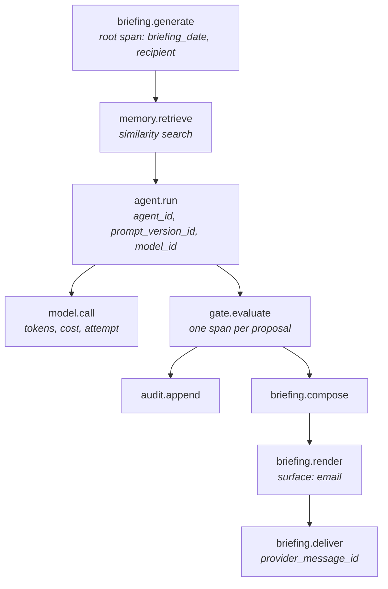

# Phase 1 — Observability Strategy

**Date:** 2026-08-03
**Status:** Draft for critical review, per `MASTER_CONSTITUTION.md` §6

The Phase 1 instantiation of `OBSERVABILITY.md`. That document sets the standard; this one names the events, fields, metrics, thresholds, and dashboards that satisfy it for one agent, one founder, and three source increments. Where the standard already says something, this document does not repeat it.

---

## 1. Why this is load-bearing at Phase 1 specifically

Phase 1 produces no effects. It observes and it recommends, and the founder acts manually in the source system. On a naive reading that makes observability a nice-to-have: nothing can go wrong that a human does not personally do.

That reading inverts the actual situation. Phase 1's deliverable is not the briefing. Per `PRD.md` §4 it is *Trust Level 1 credibility* — the evidenced belief that this system's judgment can be extended further. Every later phase is unlocked by that evidence and by nothing else. `OBSERVABILITY.md` states the principle directly: observability is the mechanism that makes trust-level advancement and revocation evidence-based rather than a gut call. Phase 1 is where that mechanism is either built or quietly skipped, and it is much easier to build it now, when the stakes are zero and the volume is one briefing a day, than later when a trust-level decision is already overdue.

Three consequences follow, and they shape everything below.

**The evidence must be durable, not merely observable.** A trust-level advancement in Phase 2 will be argued from Phase 1 records. Log retention measured in weeks cannot support a decision made in months. This is why §5 separates the ephemeral trace from the durable provenance chain, and treats the second as authoritative.

**Silence is the dominant failure mode.** `PRD.md` B1 and `ARCHITECTURE.md` §7 both say it: a missing briefing is indistinguishable from "nothing mattered today." That is the one failure this system cannot detect from the inside, so it needs a watchdog that is not part of the thing it watches (§6).

**Attribution is a first-class requirement, not an analytics luxury.** `ADR-0006` staked the entire increment sequencing argument on being able to attribute a bad briefing item to the source that caused it. If per-source attribution is not instrumented, that ADR's central mitigation does not exist.

## 2. Structured log events

All logging goes through the `Logger` interface in `API_CONTRACTS.md` §9. Event names are stable dotted identifiers; they are the query key and changing one is a breaking change to every saved query and alert.

Every event carries a common envelope, omitted from the tables below for brevity:

| Field | Meaning |
|---|---|
| `event` | the dotted event name |
| `ts` | ISO-8601 UTC |
| `level` | info / warn / error |
| `org_id` | tenant, per `ADR-0005` |
| `trace_id`, `span_id` | correlation into §5 |
| `service`, `commit_sha` | which build emitted this |
| `actor_kind`, `actor_id` | `actor_kind` from `DATA_MODEL.md` §4 |

### Ingestion

| Event | Fields beyond the envelope |
|---|---|
| `ingestion.run.started` | `source_connection_id`, `source_system`, `cursor_present` (bool, never the cursor) |
| `ingestion.page.fetched` | `source_connection_id`, `event_count`, `has_more`, `fetch_ms`, `attempt` |
| `ingestion.run.completed` | `source_connection_id`, `written`, `duplicates_skipped`, `quarantined_count`, `safe_to_advance_cursor`, `duration_ms`, `oldest_event_age_ms` |
| `ingestion.run.failed` | `source_connection_id`, `error_kind` (`FetchError.kind`), `retryable`, `retry_after_ms`, `consecutive_failures` |
| `ingestion.event.quarantined` | `source_connection_id`, `source_id`, `reason`, `schema_path` — **never** `rawPayload` |
| `ingestion.watermark.held` | `source_connection_id`, `reason`, `unprocessed_count` |
| `ingestion.watermark.advanced` | `source_connection_id`, `records_covered` |

`ingestion.watermark.held` deserves its own event rather than being an attribute of a completion. It is the correctness invariant from `ARCHITECTURE.md` §4 made visible, and a held watermark that never advances again is a silent data gap — the failure that produces an incomplete briefing while every service reports healthy.

`oldest_event_age_ms` is the raw material for the ingestion-lag metric and belongs on the run rather than being derived later, because deriving it requires reading event timestamps back out of a store whose contents are deliberately not in logs.

### Distillation

| Event | Fields |
|---|---|
| `distillation.run.completed` | `episodic_considered`, `candidates_produced`, `created`, `linked_to_existing`, `superseded`, `rejected`, `duration_ms`, `token_cost` |
| `distillation.candidate.rejected` | `reason`, `candidate_kind`, `confidence`, `derived_from_count` — never `statement` |
| `distillation.record.superseded` | `old_semantic_id`, `new_semantic_id`, `kind` |
| `distillation.dedupe.collision` | `dedupe_key_hash`, `kind`, `resolution` |

`dedupe_key_hash` rather than `dedupe_key`: the key is a normalized form of a claim and therefore derived content. Its hash is sufficient for the only question anyone asks of it in logs, which is whether the same key keeps colliding. `DATA_MODEL.md` §13 names `dedupe_key` derivation as the most consequential unresolved detail in the schema, so this event is the instrument by which that decision gets evidence.

### Agent runs and proposals

| Event | Fields |
|---|---|
| `agent.run.started` | `agent_id`, `trust_level`, `prompt_version_id`, `permitted_tools` (names), `context_record_count`, `task` |
| `agent.run.completed` | `agent_id`, `proposal_count`, `duration_ms`, `input_tokens`, `output_tokens`, `token_cost`, `model_id` |
| `agent.run.failed` | `agent_id`, `error_code`, `retryable`, `attempt`, `model_id` |
| `agent.proposal.emitted` | `proposal_id`, `agent_id`, `impact_class`, `confidence`, `evidence_count`, `rationale_length` |

`permitted_tools` is logged on every run, not once at startup. Tool scoping is the primary defense in `ARCHITECTURE.md` §5, and a defense whose actual configuration is only visible in code is a defense nobody can audit after the fact. Logging the resolved list per run makes an accidental widening — the "just for this" tool that `ARCHITECTURE.md` §11 names as the most likely path to failure — a diffable fact.

Note what is absent: the proposal payload and the rationale text. `rationale_length` is a proxy for "the model said something" that the gate already enforces as non-empty; the rationale itself lives in `agent_proposal.rationale` in Postgres, under RLS, with retention policy. Logs are the wrong home for it.

### Gate decisions

The gate is the only path from proposal to effect and it writes the audit record, so the log event here is deliberately redundant with `audit_record`. The redundancy is the point: the audit table is the legal record and the log is the operational one, and they are queried by different people on different timescales.

| Event | Level | Fields |
|---|---|---|
| `gate.decision` | info | `proposal_id`, `agent_id`, `impact_class`, `applied_trust_level`, `disposition`, `decision_ms` |
| `gate.refusal` | **error** | `proposal_id`, `agent_id`, `impact_class`, `applied_trust_level`, `refusal_reason` (enumerated code, not prose), `refused_tool` if applicable |
| `gate.malformed_proposal` | **error** | `agent_id`, `missing_field`, `impact_class_raw` (as a bounded enum-or-`invalid`, never free text from the model) |

`gate.refusal` is logged at `error` even when the gate is working exactly as designed, because the condition it reports is never normal. Per `ARCHITECTURE.md` §5 a refusal means either a bug or a prompt-injection attempt. In Phase 1, with one Trust Level 1 agent that has no execution tools, the expected lifetime count of refusals in normal operation is zero, which makes it an unusually high-signal alert and the reason it can be alerted on without threshold (§6).

`refusal_reason` is an enumerated code rather than a message. The five refusal conditions are fixed by `API_CONTRACTS.md` §6, and enumerating them means the refusal-rate metric can be broken down by cause without parsing prose.

### Briefing composition, rendering, delivery

| Event | Fields |
|---|---|
| `briefing.composition.started` | `recipient_id`, `briefing_date` |
| `briefing.composition.completed` | `briefing_id`, `recipient_id`, `briefing_date`, `item_count`, `section_counts` (map of section → count), `sections_omitted` (names), `generation_ms`, `token_cost`, `low_confidence_excluded_count` |
| `briefing.composition.failed` | `recipient_id`, `briefing_date`, `stage`, `error_code` |
| `briefing.item.composed` | `briefing_id`, `briefing_item_id`, `proposal_id`, `section`, `rank`, `trust_level`, `evidence_count`, `source_systems` (distinct set) |
| `briefing.render.completed` | `briefing_id`, `surface`, `html_bytes`, `text_bytes`, `render_ms` |
| `briefing.delivery.succeeded` | `briefing_id`, `provider_message_id`, `recipient_hash`, `attempt`, `latency_ms` |
| `briefing.delivery.failed` | `briefing_id`, `error_code`, `retryable`, `attempt` |
| `briefing.failure_notice.sent` | `recipient_hash`, `reason_code` |
| `briefing.opened` | `briefing_id`, `seconds_after_delivery`, `user_agent_class` (`mobile`/`desktop`/`unknown`) |
| `briefing.evidence.clicked` | `briefing_id`, `briefing_item_id`, `source_system` |

`source_systems` on `briefing.item.composed` is the per-source attribution mechanism `ADR-0006` depends on. When the founder flags an item as misleading, the join from flag to item to contributing source systems is what turns "the briefing was wrong" into "the transcript adapter was wrong," and it only works if the set was recorded at composition time rather than reconstructed later from a memory graph that has since been superseded.

`low_confidence_excluded_count` instruments `PRD.md` A3. An exclusion rule that silently drops everything is indistinguishable from a quiet day, which is the same class of failure as silence itself.

`recipient_hash` rather than the address. The recipient is one known person; the address adds no diagnostic value and putting an email address in log lines is exactly the habit that becomes a leak at 10,000 users.

### Founder feedback and security-relevant events

| Event | Level | Fields |
|---|---|---|
| `feedback.error_flag.raised` | **warn** | `briefing_item_id`, `briefing_id`, `proposal_id`, `agent_id`, `prompt_version_id`, `section`, `source_systems`, `note_present` (bool) |
| `security.source_auth_failed` | **error** | `source_connection_id`, `source_system`, `error_kind` |
| `security.secret_resolution_failed` | **error** | `secret_ref` (the name — it is a name by construction, per `DATA_MODEL.md` §5), `caller` |
| `security.rls_denied` | **error** | `table`, `operation`, `claimed_org_id`, `session_org_id` |
| `security.tenant_context_missing` | **error** | `repository`, `method` |
| `security.audit_write_failed` | **error** | `proposal_id`, `error_code` |

`feedback.error_flag.raised` is a `warn`, not an `info`. It is the primary Phase 1 exit metric (`PRD.md` §5) and a single occurrence resets a fourteen-day window. It carries `prompt_version_id` because the flag is worthless to the Phase 3 learning loop without knowing which prompt produced the item, and `note_present` rather than `note` because the founder's note is free text about a real person's email.

`security.audit_write_failed` is the most serious event in this table. If the audit write fails, the gate's central guarantee — that authorizing and logging are the same operation — has been broken. The correct behavior is to fail the proposal closed rather than proceed unlogged, and this event is the record that it happened.

## 3. Metrics

Emitted through the `Metrics` interface in `API_CONTRACTS.md` §9. Naming is `leap.<subsystem>.<measure>`; tag cardinality is deliberately tiny, because at one tenant and four source systems there is no reason for a tag to be unbounded and an unbounded tag is how derived content leaks into a metrics backend.

### Product metrics — the PRD's primary set

| Metric | Type | Tags | Notes |
|---|---|---|---|
| `leap.briefing.open_rate` | derived gauge | — | opens within 3h ÷ delivered, trailing 14 weekdays. Target ≥ 90% (`PRD.md` §5) |
| `leap.briefing.open_latency_seconds` | histogram | `user_agent_class` | disambiguates "high trust" from "unread" alongside click rate |
| `leap.briefing.consecutive_weekday_streak` | gauge | — | the sustained-use metric; the exit criterion is 14 with no gap > 1 day |
| `leap.feedback.misleading_flags` | counter | `section`, `source_system` | target **zero** over the final 14-day window; the `source_system` tag is the per-source error attribution in `PRD.md` §5 secondary |
| `leap.feedback.novel_priority_marks` | counter | `section` | the ≥ 1-per-briefing novel-priority rate |
| `leap.founder.self_reported_minutes_saved` | gauge | — | written once weekly from the survey; a manually-fed metric, and honest to label as such |

### Product metrics — secondary

| Metric | Type | Tags | Notes |
|---|---|---|---|
| `leap.briefing.item_count` | histogram | — | firehose watch; past ~12 the briefing is regressing (`ARCHITECTURE.md` §7) |
| `leap.briefing.evidence_click_rate` | derived gauge | `source_system` | interpreted only against open latency, never alone |
| `leap.ingestion.lag_seconds` | histogram | `source_system` | event `occurred_at` → episodic `ingested_at` |
| `leap.briefing.generation_ms` | histogram | — | from `briefing.generation_ms` |
| `leap.briefing.token_cost_usd` | histogram | — | from `briefing.token_cost`; the cost dimension of the §19 self-review |

### Operational metrics

| Metric | Type | Tags | Notes |
|---|---|---|---|
| `leap.gate.decisions` | counter | `disposition`, `impact_class` | refusal *rate* is derived from this rather than counted separately, so the denominator is always available |
| `leap.gate.refusals` | counter | `refusal_reason`, `agent_id` | expected steady state: zero |
| `leap.ingestion.consecutive_failures` | gauge | `source_system` | mirrors `ingestion_watermark.consecutive_failures` |
| `leap.ingestion.quarantined` | counter | `source_system`, `reason` | a spike is either an upstream schema change or an attack |
| `leap.model.api_errors` | counter | `error_code`, `model_id` | |
| `leap.model.calls` | counter | `agent_id`, `model_id` | denominator for the above |
| `leap.distillation.records_written` | counter | `kind`, `outcome` (created / linked / superseded / rejected) | |
| `leap.job.duration_ms` | histogram | `job_name`, `outcome` | one metric for every `ScheduledJob` |
| `leap.db.query_ms` | histogram | `repository`, `method` | the only place performance regressions in memory access will show up early |

Two metrics are deliberately **not** collected: session count and time-in-product. `PRD.md` §5 rejects them explicitly, and instrumenting a metric one has committed not to optimize is how it becomes a goal anyway.

## 4. Explainability

`OBSERVABILITY.md` requires that any recommendation answer, on demand: what data was used, which agent produced it, what trust level authorized it, and what alternative was considered and rejected.

At Phase 1 this is a shipped, tested code path, not a SQL exercise someone performs under pressure:

```ts
explain(ctx: TenantContext, itemId: BriefingItemId): Promise<Result<Explanation>>
```

`Explanation` resolves the full chain and is assembled entirely from durable records:

| Question | Answered from |
|---|---|
| What data was used? | `briefing_item_evidence` → `semantic_record` → `semantic_link` → `episodic_record` → `source_connection` |
| Which agent produced it? | `briefing_item.proposal_id` → `agent_proposal.agent_id` and `.prompt_version_id` |
| Under what trust level? | `agent_proposal.trust_level`, recorded at gate time (`DATA_MODEL.md` §9) |
| What was rejected? | sibling `agent_proposal` rows from the same run with disposition `discarded` or `refused` |
| What was superseded? | `semantic_record.superseded_by` chain walked backward |

The trust-level column is why this works retroactively. Because `agent_proposal.trust_level` and `GateDecision.appliedTrustLevel` capture the authority in force *at the time*, raising an agent's trust level in Phase 2 does not rewrite what authorized a Phase 1 recommendation.

The governance rule from `OBSERVABILITY.md` applies without softening. If `explain()` cannot answer all five questions for an item, the system is not ready to act at that trust level and is dialed back to Recommend until it can. At Phase 1, where Recommend is already the ceiling, the equivalent sanction is stronger and simpler: **an item that cannot be explained is a Phase 1 exit blocker.** A weekly audit samples five delivered items and runs `explain()` against each; a single unexplainable item is a defect, not an anomaly.

## 5. Tracing

Two traces exist, they answer different questions, and conflating them is the mistake to avoid.

**The ephemeral trace** is conventional distributed tracing over a single run, retained for days, used to answer "why was this slow" and "where did this throw."



Ingestion and distillation runs are separate root spans, because they are separate scheduled jobs on a fifteen-minute cycle (`ARCHITECTURE.md` §8) and forcing them into the briefing's trace would produce a trace that spans a day and means nothing. They are joined to the briefing by record identity, not by trace context. Every episodic and semantic record therefore stores the `trace_id` of the run that wrote it, in its provenance columns, so a briefing item can be walked back to the ingestion trace that produced its evidence even though the two traces are distinct.

**The durable provenance chain** is the referential graph in Postgres described in §4. It is the authoritative answer to `OBSERVABILITY.md`'s requirement that a single briefing be traceable back through every agent and record that contributed to it, because it survives as long as the audit record does. Trace retention is days; `audit_record` retention is seven years (`DATA_MODEL.md` §12). Any explainability guarantee built on trace storage would expire long before the obligation does.

Span attributes follow the same redaction rules as log fields (§7). A span attribute is a log field with worse tooling around it and is more easily forgotten.

## 6. Alerting

`UX_PRINCIPLES.md` names alert fatigue as something that *directly undermines the Trust Framework*, and the observation generalizes past confirmation dialogs. Phase 1 has exactly one human, who is also the user, and who is also the person whose inbox is one of the systems being monitored. An alert he learns to ignore is worse than no alert, because it converts a real signal into noise permanently.

So the list is short, every entry is actionable, and there are three tiers with genuinely different urgency:

| Tier | Channel | Meaning |
|---|---|---|
| **P1 — page** | phone push / SMS | the founder's day is already wrong or about to be; act now |
| **P2 — notify** | a dedicated operations address, **not** the briefing inbox | look today; the system is degraded but the founder is not misled |
| **P3 — report** | the briefing's `system_health` section | for the record; no interruption |

| Alert | Tier | Condition | Action it implies |
|---|---|---|---|
| Briefing not delivered by deadline | **P1** | no `briefing.delivery.succeeded` for today by `T+15min` on a weekday | run the generator manually; it is idempotent per (org, recipient, date) |
| Gate refusal | **P2** | **any** `gate.refusal` or `gate.malformed_proposal` | read the proposal; classify as bug or injection; per `OBSERVABILITY.md` and `ARCHITECTURE.md` §5 |
| Security-relevant event | **P2** (P1 for `security.audit_write_failed`) | any `security.*` event | incident record per `SECURITY_STANDARDS.md`, regardless of severity |
| Briefing generation failure | **P2** | `briefing.composition.failed` or `briefing.delivery.failed` after retries | the founder already has a failure notice (`PRD.md` B1); this tells the operator why |
| Source consecutive failures | **P2** | `consecutive_failures >= 3` for any connection | re-auth or fix the adapter; the briefing is silently incomplete until then |
| Cost anomaly | **P2** | daily `token_cost` > 3× trailing 7-day median, or > an absolute daily ceiling | inspect for a retry loop or a context-size regression |
| Model API error rate | **P3** | > 25% of `leap.model.calls` failing over 15 min, without a generation failure | note it; if it causes a generation failure that alert already fired |
| Ingestion lag | **P3** | p95 `leap.ingestion.lag_seconds` > 30 min for a source | note it; it degrades freshness, not correctness |

Four points about this list.

**The delivery alert is a dead-man's switch and must live outside the system it watches.** A generator that crashed cannot alert on its own failure to run, and the absence of a briefing is the worst failure available to a trust-building product. The watchdog is a separate scheduled check with its own alerting path, and its own liveness is verified by requiring it to emit a heartbeat that the P3 health view displays.

**Gate refusals alert without a threshold** because the expected count is zero. This is the rare case where a rate threshold would be strictly worse than an absolute one: a threshold implies a normal nonzero rate, and normalizing gate refusals is precisely the erosion `ARCHITECTURE.md` §11 warns about.

**The absolute cost ceiling matters more than the anomaly ratio at first.** With no history, a 3× median rule has no median. Phase 1 starts with an absolute daily cap and adds the ratio rule once fourteen days of data exist.

**Nothing here alerts on a single flagged item.** The misleading-recommendation count is the most consequential Phase 1 metric and it is deliberately a P3 report. It is a quality signal for a weekly review, not an interruption, and paging the founder about feedback he just gave would be absurd.

## 7. Redaction

No logger call, metric tag, or span attribute may carry message bodies, transcript text, distilled claim text, or credentials. Restated from `API_CONTRACTS.md` §9 because Phase 1's specific obligation is to make it enforceable rather than aspirational.

Three enforcement layers, in increasing order of strength:

**A denylist lint rule.** A custom ESLint rule fails the build when a known-sensitive identifier appears as a key in an object literal passed to `Logger`, `Metrics`, or span attributes. The initial denylist: `payload`, `rawPayload`, `body`, `bodyText`, `snippet`, `transcript`, `text`, `statement`, `attributes`, `note`, `headline`, `detail`, `subject`, `html`, `email`, `secret`, `token`, `accessToken`, `refreshToken`, `apiKey`, `cursor`, `dedupeKey`, `embedding`.

Two entries on that list are non-obvious and both are deliberate. `headline` and `detail` are LEAP-authored prose, which makes them feel safe; they are summaries of a real person's email and are exactly as sensitive as the email. And `cursor` is an opaque provider token which in some providers embeds account identifiers — `DATA_MODEL.md` §5 already establishes that the pipeline never interprets it, and it should not log it either.

**A runtime emission test.** An integration test drives a full ingestion → distillation → briefing cycle against fixtures whose sensitive fields contain unique sentinel strings, captures every emitted log line, metric tag, and span attribute, and asserts no sentinel appears anywhere in the captured output. This is the layer that actually holds: the lint rule catches the field named `body`, and the test catches the field named `context` that happens to contain a body three levels down.

**An allowlist at the sink.** The logger serializes only primitives and explicitly-registered field names; an unrecognized field is dropped with a counter increment rather than emitted. A denylist protects against the sensitive fields we thought of. An allowlist protects against the one we add next quarter, which is the one that will leak.

The same discipline does not apply to Postgres. `episodic_record.payload` holds message bodies by design, under RLS, with retention (`DATA_MODEL.md` §12) and an open question about column-level encryption. The distinction is deliberate: the database is a governed store with tenant isolation and a deletion policy; a log aggregator is a third-party system with none of those properties. Content lives in the former and never in the latter.

## 8. Retention

Following the lifecycle discipline `OBSERVABILITY.md` inherits from `MEMORY_ARCHITECTURE.md`.

| Signal | Retention | Rationale |
|---|---|---|
| Structured logs | 30 days hot, 90 days cold | operational debugging window; not the explainability substrate |
| Traces | 7 days, sampled 100% | one briefing a day makes full sampling free and sampling decisions pointless |
| Metrics | raw 14 days, 1-hour rollups 13 months | 13 months so year-over-year and the §19 self-review have a baseline |
| `audit_record` | 7 years, never deleted | `DATA_MODEL.md` §12; redaction rather than deletion for data-subject requests |
| `agent_proposal` | 7 years, aligned with audit | a refusal without its proposal is not reviewable |
| `briefing`, `briefing_item` | 2 years | `DATA_MODEL.md` §12 |
| `error_flag` | indefinite | the learning loop's training signal |

Logs and traces intentionally have short lives, and this is only safe because the explainability guarantee rests on the durable chain in §5 rather than on them. If that ever inverts — if answering "why did the system say this" requires a log search — retention becomes a compliance obligation rather than an operations preference, and these numbers must change.

## 9. Dashboards at Phase 1

One dashboard. Building a second is how a single-user system acquires an observability surface nobody looks at.

The **System Health view** carries eight tiles, and its content is chosen so that it can be rendered twice: once as an operator web view, and once as the `system_health` section of the briefing (`DATA_MODEL.md` §10, `MASTER_CONSTITUTION.md` §14). The briefing section is the same data with plainer language, which is the honest reason to keep the tile list short.

| Tile | Signal |
|---|---|
| Briefing delivered today | delivered / not delivered, with time |
| Per-source freshness | last successful ingestion and `consecutive_failures` per connection |
| Ingestion lag | p95 per source, last 24h |
| Gate activity | dispositions last 24h, refusals highlighted if nonzero |
| Items per briefing | 14-day sparkline against the ~12 ceiling |
| Cost | token cost per briefing, 14-day sparkline, month-to-date total |
| Open and flag history | 14-day open streak and flag count |
| Watchdog heartbeat | last heartbeat from the delivery watchdog |

Deliberately absent: uptime percentages, queue depth, and anything resembling a service map. `OBSERVABILITY.md` asks for uptime, latency, error rate, and queue depth per service; Phase 1 has one process and no queues, so a queue-depth tile would report zero forever and teach the reader that this dashboard contains nothing worth reading. `ARCHITECTURE.md`'s scheduler is cron, not a work queue. When a queue exists, the tile arrives with it.

## 10. Residual risks and open questions

**Email open tracking is unreliable, and it underpins a primary metric.** Open detection depends on a tracking pixel, and image blocking, privacy proxies, and Apple Mail Privacy Protection all defeat it. `PRD.md` §5 makes open rate a primary metric with a 90% target and makes a 14-day open streak an exit criterion. A tracking failure is therefore indistinguishable from non-adoption. Mitigation: treat the flag affordance and evidence-link clicks as corroborating signals, and — more honestly — ask the founder directly during the weekly survey. This is the weakest measurement in Phase 1 and it should be named as such rather than reported as a clean number.

**Two of five primary metrics are self-reported by a sample of one.** Novel-priority rate and minutes saved come from the person who wants the project to succeed. Nothing available at Phase 1 fixes this. It is a reason to weight the misleading-recommendation count, which is falsifiable, more heavily than the two that are not.

**Zero-refusal steady state means the refusal alert is untested in production.** An alert that never fires and a broken alert look identical. Mitigation: a deliberate synthetic refusal, using the misbehaving-agent test fixture from `ARCHITECTURE.md` §11, fired against staging on each release, plus a monthly production-path verification.

**Circular dependency in the alerting channel.** P2 alerts go to email, and Gmail is one of the observed systems. A Google Workspace outage would take out both the source and the notification path simultaneously. Accepted at Phase 1; the P1 channel is deliberately not email for this reason.

**Open: observability vendor.** Structured logs, metrics, and traces need a destination. The `Logger` / `Metrics` / `Tracer` interfaces in `API_CONTRACTS.md` §9 exist so this is a swap rather than a rewrite, but the choice interacts with the redaction posture in §7 — some vendors' auto-instrumentation captures request bodies by default, which would defeat every layer described above. Any vendor decision must include disabling that explicitly.

**Open: where the alert deadline comes from.** The P1 delivery alert needs a delivery deadline, which needs the founder's briefing time and timezone. That is `PRD.md` open question 3, and the watchdog cannot be configured until it is answered.
